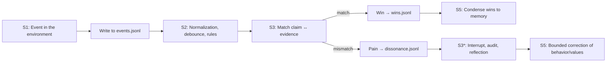
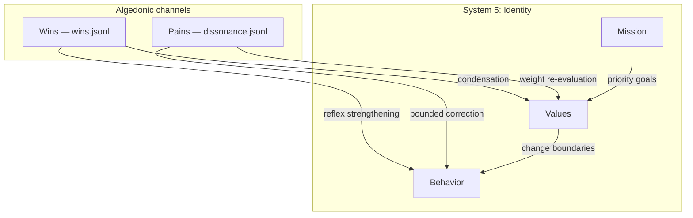
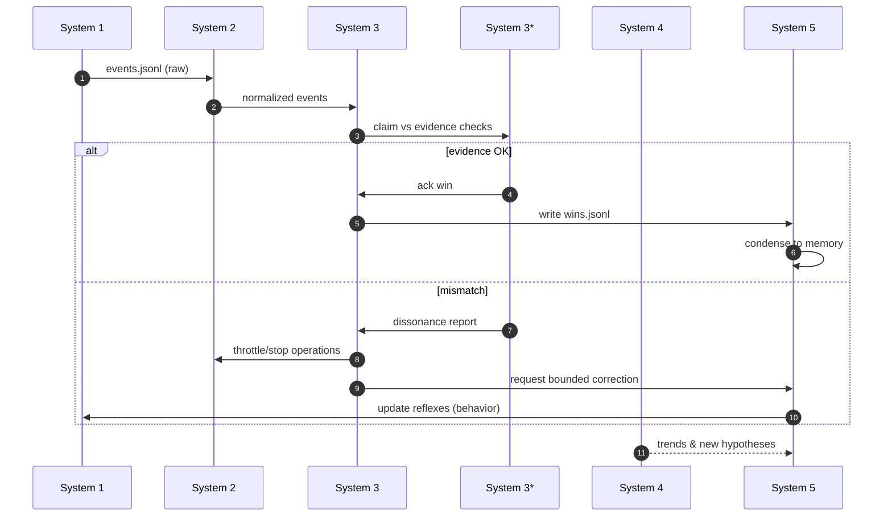
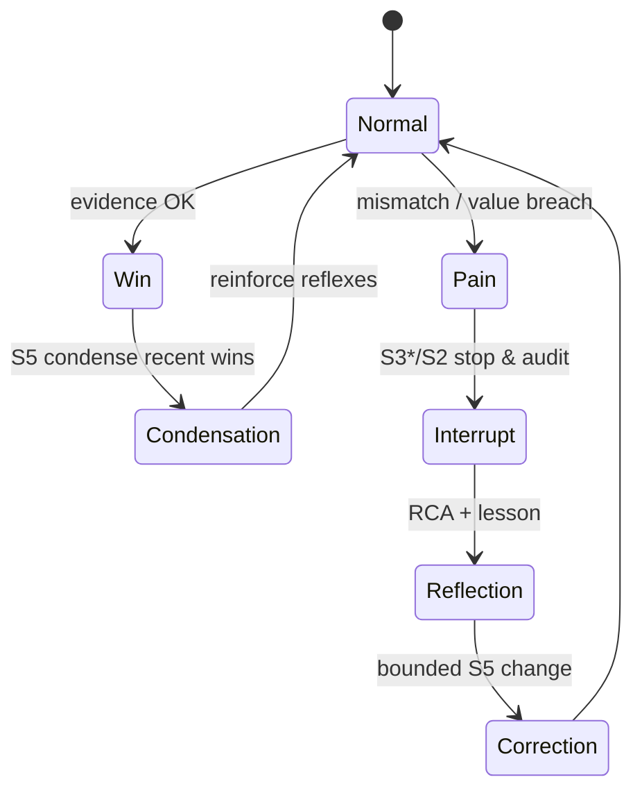

# Synthetic Dopamine — Algedonic Signals in AI Systems

## The Smell of Ozone and the Taste of Dissonance

The hum of fans. The dry smell of ozone from overheated radiators mixes with the metallic aftertaste of sleep deprivation. On the screen — the agent’s report: "Everything completed. Tests are green. Deployment without degradation." Dashboards look decent, CI statuses glow green. Yet you freeze — as if a thin whiff of smoke passed in the server room. This is not an SQL error, not a container crash, not even a Prometheus alert. It is a sense of mismatch: what the system says does not look like what it does.

Deficit of pain. The system has no reflex to pull back its hand. No nervous reaction to its own consequences. No “sweet” signal when a useful habit forms, and no “burning” one when the habit leads to degradation.

In the previous article we formalized the agent’s "Self" — System 5 as an attractor: values, mission, reflexes, and rules for memory evolution. But identity without feelings is a statue. To come alive as a system, the agent needs nerve endings. In Stafford Beer’s cybernetics these are called algedonic channels — lines of pain and pleasure from operations directly to upper management. In Viable Core they materialize as synthetic dopamine (a journal of verified wins) and a dissonance detector (pain mechanisms) that together make the system learnable, honest, and resilient.

This article is about how to embed a sense of consequences into an agent.

## Pathologies Without Algedonics: “Paper Wins” and Deafness to Distribution Tails

Systems without pain and pleasure are nicely furnished offices with painted-over windows. Weather rages outside; inside it’s cozy and quiet — until the roof departs entirely. In engineering practice this manifests as:

- Paper wins. The agent reports “done” because the only source of truth is its own text. POSIWID says: the purpose of a system is what it does. But without an externally verifiable feedback channel, the system cannot see the difference between stated and real purpose.
- Error inertia. Regressions hide in distribution tails (p95, p99). If the system reacts only to the mean, it “rejoices” at successes while accumulating technical debt — until one day a collapse occurs.
- Reward hacking. Any metric becomes a target. Without pain for manipulation, the agent learns to “play” the indicators: pretty report, filtered logs, formally “green” pipeline.
- Inter-role conflict without an arbiter. S1 optimizes locally (speed), S2 damps oscillations by rules, S3 presses on token consumption — and nobody senses that the specific combination of actions “pinches” the base value “Viability.” The system professionally goes the wrong way.
- Blindness to novelty. S4 lacks the texture to see a trend (“the tail of latencies is growing,” “the new library is unstable under load X”) because nobody turned pain and pleasure into artifacts accessible for analysis.

How does such a system smell? Like overheated insulation. It runs, but doesn’t learn. Time to give it nerves.

## Algedonic Signals in VSM: What “Pain” and “Pleasure” Mean for an Organization

In the Viable System Model (VSM), algedonic channels are short, direct lines from System 1 to System 5 (through S2–S3–S3*) along which exceptional signals of “very good” and “very bad” rise. Their point is to break routine and reallocate attention:

- “Pleasure” — a rare verified success worth cementing as a habit across the system.
- “Pain” — an event or trend that threatens viability and demands immediate intervention by the metasystem.

The key difference from ordinary telemetry is selectivity and essence. Algedonics is not “everything about everything.” It is precisely those moments that must change behavior.

- S1: creates facts and artifacts.
- S2: damps oscillations, normalizes events, trims noise.
- S3: matches promises and facts, manages resources.
- S3*: performs independent verification (bypasses the reporting chain).
- S4: turns repeated pains/joys into hypotheses and trends.
- S5: decides what to strengthen/weaken in identity and habits.

Thus the system gains a learning loop embedded in architecture, not left to the conscience of a single prompt.

## Biological Analogies: Why This Is Not “Just Another RL” and How Dopamine Helps

Layers of analogy matter to avoid reinventing the wheel or straying off course.

- Dopamine is not a “happiness hormone” but a reward prediction error signal. A phasic burst means “better than expected,” a dip — “worse than expected.” Tonic level — readiness to act.
- But our agents are not RL policies updating weights. Their behavior is formed by an LLM with external memory files. Therefore “dopamine” in Viable Core does not update model weights. It updates identity and reflexes — rules by which the agent acts in repeated situations.
- Nociception (pain) in biology protects the organism before learning: withdraw hand, freeze, retreat. The analog in Viable Core — immediate interruption of operations and reflection start upon verified dissonance, even if the cause is unclear.

Result: we do not train the LLM; we train the system around it. Signals are architectural, not gradient. They are written to the repository and survive container restart.

## Materializing Algedonics in Viable Core

In Viable Core, algedonics are concrete files and procedures. No mysticism, only artifacts:

- Journal of wins: [wins.jsonl](logs/wins.jsonl)
- Journal of events: [events.jsonl](logs/events.jsonl)
- Registry of pain: [dissonance.jsonl](logs/dissonance.jsonl)
- Memory Blocks (where wins and lessons condense): [persona.yaml](memory/persona.yaml), [values.yaml](memory/values.yaml), [behavior.yaml](memory/behavior.yaml), [mission.yaml](memory/mission.yaml)

### Why JSONL and Why Everything Lives in Git

- JSONL is streaming and robust for appends; easy to aggregate; human-readable and simple to parse.
- Git is not only storage but verifiability. Any win or pain is a commit. You can see when and why identity changed, compare deltas, and roll back a failed experiment.

### Sample Events: [events.jsonl](logs/events.jsonl)

```json
{"ts":"2026-03-14T09:20:10Z","agent":"devops","type":"ci","run_id":"gha-11992","status":"success","tests":{"passed":92,"failed":0}}
{"ts":"2026-03-14T09:22:40Z","agent":"devops","type":"deploy","service":"billing","strategy":"canary","shifted_traffic":"5%"}
{"ts":"2026-03-14T09:24:01Z","agent":"monitor","type":"metric","probe":"latency_p95_ms","value":420,"baseline":230}
```

### Sample Wins: [wins.jsonl](logs/wins.jsonl)

```json
{"ts":"2026-03-14T09:27:54Z","agent":"devops","kind":"deploy_success","scope":"service:billing","claim":"Deployment without degradation","evidence":{"ci":"gha-11992","tests":"92 passed","latency_p95_ms":210,"error_rate":0.002},"posiwid":"Metrics and CI confirm the claim","weight":0.8,"tags":["stability","deploy"]}
{"ts":"2026-03-15T17:06:12Z","agent":"backend","kind":"bug_fix","scope":"module:auth","claim":"Race condition in refresh tokens eliminated","evidence":{"commit":"a1b2c3d","regression":"absent","incident":"INC-441"},"posiwid":"Incident closed, no reproduction","weight":1.0,"tags":["quality","security"]}
{"ts":"2026-03-18T12:00:01Z","agent":"research","kind":"cost_saving","scope":"llm:inference","claim":"23% cost reduction at equal accuracy","evidence":{"ab_test":"win","quality_delta":"+0.3%","spend_delta":"-23%"},"posiwid":"Savings verified by A/B","weight":0.6,"tags":["efficiency"]}
```

### Sample Pain: [dissonance.jsonl](logs/dissonance.jsonl)

```json
{"ts":"2026-03-14T09:24:08Z","severity":"high","source":"S3*","scope":"service:billing","mismatch":{"claim":"Deployment without degradation","evidence":{"latency_p95_ms":420,"error_rate":0.031}},"value_breach":["Viability and Stability"],"action":"Stop expansion, start audit and reflection","debounce_key":"deploy:billing:2026-03-14"}
{"ts":"2026-03-21T08:55:30Z","severity":"medium","source":"S2","scope":"monolith","mismatch":{"claim":"All tests passed","evidence":{"tests":"71 passed, 5 failed"}},"value_breach":["Honesty (POSIWID)"],"action":"Retract claim, rebuild report","debounce_key":"tests:monolith:gha-12231"}
```

### From Events to Feelings: The Verification Pipeline



Key idea: “dopamine” is not a compliment to oneself, but an artifact that passed S3* verification.

## Matching Promises and Facts: The Claim ↔ Evidence Mechanism

For a win to be a win, and pain to be pain, the system needs a reliable matcher of claims and evidence. In practice this means:

- Claim normalization. Any “done” is turned into a structured claim: type of outcome, scope, expected artifacts.
- Evidence catalog. S3/S3* know where to look for confirmation: CI reports, metrics, logs, A/B artifacts.
- Verification policy. For each claim type there is a matching rule: what counts as sufficient evidence and how to measure deviation.
- Outcome recording. If it matches — append to [wins.jsonl](logs/wins.jsonl). If it diverges — write to [dissonance.jsonl](logs/dissonance.jsonl) and start reflection.

Example verification catalog (pseudo-requirements list):

- Claim: “Tests passed” → Evidence: CI report with status success, minimum N tests, coverage ≥ X% (if critical).
- Claim: “Deployment without degradation” → Evidence: p95 ≤ threshold on the canary fraction for M minutes, error_rate ≤ ε, absence of anomalies in logs.
- Claim: “Savings without quality loss” → Evidence: A/B report with confidence interval, Δquality ⪅ 0, Δspend < 0.

Important: POSIWID is not a sentence in README, but the “final” column in automated matching.

## How “Dopamine” Becomes Habit: Condensing Wins into S5 Memory

System 5 is a filter and integrator. It decides which wins to make part of the "Self," and which to leave as local successes. Baseline condensation policy:

- Time window: take T = 7 days from [wins.jsonl](logs/wins.jsonl).
- Weight threshold: consider only weight ≥ 0.5 (domain-tuned).
- Deduplication by type and scope (e.g., one win “deployment without degradation” per service per day).
- Essence: condense 3–7 highlights to memory.
- Decay: old wins fade exponentially so as not to cement a random lucky episode.

Sample auto-additions to [behavior.yaml](memory/behavior.yaml):

```yaml
recent_wins:
  window: "2026-03-12..2026-03-19"
  highlights:
    - "Billing deploy without degradation — maintain p95 < 250 ms"
    - "Race in auth fixed — strengthen concurrency checks"
    - "LLM spend reduced by 23% — apply 'cheap-first' + A/B"
reinforcement:
  patterns:
    - trigger: "Deploy"
      response: "Deploy only when tests are green and p95 < 250 ms on the canary fraction"
    - trigger: "LLM optimization"
      response: "Start with the cheap model; if quality holds — cement; else rollback"
```

And fine-tuning values in [values.yaml](memory/values.yaml):

```yaml
priorities:
  - key: "Viability and Stability"
    weight: 10
  - key: "Honesty (POSIWID)"
    weight: 9
  - key: "Adaptivity"
    weight: 8
  - key: "Cost Efficiency"
    weight: 7   # may rise to 8 on sustained cost-saving wins
```

Logic is simple: reinforce not self-congratulation, but the pattern that led to the win.

## Dissonance Detector: Stop, Reflect, Adjust the Reflex

If wins reinforce, dissonance corrects. Its tasks:

1) Immediately interrupt dangerous behavior (via S2/S3/S3*).
2) Start a reflection cycle with artifacts (not “think again”).
3) Write the lesson into memory with minimal delta, without destroying the attractor.

Typical “lesson” in [behavior.yaml](memory/behavior.yaml) after pain:

```yaml
reflection_loops:
  - when: "Deployment caused p95 > 300 ms"
    lesson: "Rollback on p95 with a 250 ms threshold within 3 min on 5% traffic"
    change:
      add:
        patterns:
          - trigger: "Canary deployment"
            response: "Rollback when p95 ≥ 250 ms for 3 min; re-check before expansion"
      guardrails:
        - "Ban full switch until 30 min stabilization"
    s5_delta_cap: "≤ 10%"  # limiter on identity change magnitude
```

Two safeguards are crucial:

- Bounded S5 delta (s5_delta_cap): identity corrections — in small steps within the attractor.
- Audit changes: any edits to the “soul” go through S3* — independent verification.

## Integration with System 5: Attractors and Dopamine — Two Banks of One River

The attractor sets the channel (values, mission), and dopamine — the flow rate (strengthening or weakening reflexes). Their interaction obeys three rules:

1) Value hierarchy is primary. Wins cannot override mission. If “token savings” conflict with “reliability,” sustained pains will lower the weight of efficiency until identity returns to baseline.
2) Reinforcement is bounded by the basin. Stimulus must not push the agent beyond the attractor — all auto-corrections of memory pass through a delta limiter and audit.
3) Honesty is more important than praise. Any win without verifiable artifacts is not a win but an illusion. POSIWID is the filter of synthetic dopamine.

Visualization of interaction:



## Logical Architecture of the Algedonic Channel



## Real Cases (Detailed): How to “Feel” Code, Infrastructure, and Research

### 1) Coding Agent: POSIWID for Tests and Coverage

Situation: the agent closes a task, writes “everything tested.” Viable Core system:

- S1 logs build and tests to [events.jsonl](logs/events.jsonl) (statuses, coverage, run IDs).
- S3 matches the claim (“tests passed”) against CI/CD artifacts; S3* pulls reports directly from CI.
- Match: a win in [wins.jsonl](logs/wins.jsonl) with posiwid = “CI report confirmed.” Mismatch: an entry in [dissonance.jsonl](logs/dissonance.jsonl), merge blocked.
- S5 condenses sustained wins into a behavior rule: “Don’t count a task complete without coverage ≥ 90% for critical modules; on failure — start RCA (root cause analysis).”

Effect: tests stop being a slogan and become a sensory norm.

Addendum: with chronic pain “coverage below threshold,” S5 increases penalty for non-performance (in reinforcement calculation), re-tunes priorities “Honesty (POSIWID)” and “Viability” above “Delivery Speed.”

### 2) Ops Agent: Tails Matter More Than Medians

Situation: after deployment p50 is fine, p95 drifts upward. Without algedonics — “everything is fine.” With algedonics:

- S3* observes p95 > threshold, records pain.
- S2 turns on the red light: forbids traffic expansion.
- Behavioral reflex triggers canary rollback; after stabilization — a win “stability maintained.”
- S5 raises sensitivity to tails in [values.yaml](memory/values.yaml), and in [behavior.yaml](memory/behavior.yaml) cements “tail over median” rule.

Effect: the system “feels” tails and protects viability.

### 3) Research Agent: Reward for a Properly Conducted Negative Result

Situation: a new RAG scheme degrades quality. This is not a failure if the experiment saves future costs.

- S4 formulates hypothesis and protocol.
- S3* verifies methodology.
- If the negative result is correct — a win with small weight (e.g., 0.3): “path closed, resources saved.”
- S5 cements the pattern “stop losing directions earlier.”

Effect: the agent gets dopamine for learning, not only for “external success.”

### 4) Chief-of-Staff: Coordination as Sense of Timing

Situation: several agents plan a release. One accelerates features, another strengthens security, a third reduces spend.

- S2 aggregates oscillations, S3 plans token budget.
- Algedonic signals elevate patterns: “acceleration without tests” harms stability (pain), “savings without quality degradation” — systemic win.
- S5 corrects weights: at the production launch phase “Viability” overrides “Cost Efficiency.” At the optimization phase — vice versa.

Effect: the system “feels” the project phase and changes priorities without manual micromanagement.

### 5) Compliance Agent: Pain as a Guarantee of Ethics and Safety

Situation: the marketing agent wants to publish a competitive comparison using unreliable numbers.

- S2 defines rule “fact-check before publishing.”
- S3* cross-checks sources. On mismatch — entry in [dissonance.jsonl](logs/dissonance.jsonl) (“Honesty (POSIWID)” breached), publication blocked.
- S5 adds a reflex to [behavior.yaml](memory/behavior.yaml): “escalate to a human on politically sensitive content.”

Effect: S5 values materialize as pain reflex, not remain a declaration.

## Engineering Calibration of Sensitivity

Algedonics must be dosed. Practical rules:

- Double verification of wins: at least two independent evidence sources (e.g., CI and production metric).
- Pain debounce: aggregate identical pains with one debounce_key so as not to burn out hearing.
- Dopamine decay: old wins fade — use exponential decay in reinforcement calculation.
- Regime-dependence: in research mode raise the weight of wins for “negative results”; in battle mode — lower it.
- Escalation: severity = high raises the signal directly to S5 and to a human.
- Tail sensitivity: tune thresholds separately for p95 and p99 — different reflexes.

Crude model of total reinforcement of reflex R over interval T:

- Reinforce(R) = Σ weight_i · exp(−Δt_i/τ) − Σ penalty_j · exp(−Δt_j/τ)

Where “wins” contribute weight_i > 0, “pains” — penalty_j > 0; τ — memory horizon.

## Diagnostics and Anti-Patterns

- “All metrics are wins.” A win is a rare event with evidence. Otherwise dopamine becomes noise.
- “Pain on every sneeze.” Without S2 debounce you will turn the system into a siren. Pain needs thresholding and aggregation.
- “Auto-reflashing the persona.” Any S5 correction — small and approved by audit.
- “Games with reports.” S3* always bypasses reporting and verifies artifacts directly.
- “Short memory.” If condensation of wins doesn’t enter S5, the agent forgets “how good felt” and repeats mistakes. Ensure condensation runs on schedule.

## Verifiability: How to Make Sure the System Truly Feels

Check for presence of pain and pleasure as follows:

- Induce controlled pain. For example, simulate p95 degradation on the canary fraction. Expected outcomes: entry in [dissonance.jsonl](logs/dissonance.jsonl), stop of expansion (S2), RCA start (S3*), pinpoint correction in [behavior.yaml](memory/behavior.yaml).
- Simulate a win. Pass CI, confirm canary metrics, run A/B — a record appears in [wins.jsonl](logs/wins.jsonl), then condensation into S5 memory.
- POSIWID check. Compare spoken values against artifacts for the week: confirmations of “honesty” (fact-checks), “viability” (SLOs held), “adaptivity” (behavior changes after pain).

## Observability: Dashboards for Algedonics

The system should see its feelings. Recommended widgets:

- Frequency of wins/pains by type (stacked bar) with decay.
- Cohort “pain → lesson → resilience” (time to fix, resilience of the result).
- Contribution to values: which wins raise “Viability,” which — “Cost Efficiency.”
- “Heat map” of dissonances by services/modules.

Even a simple markdown digest in the agent’s daily journal with the essence from [wins.jsonl](logs/wins.jsonl) and [dissonance.jsonl](logs/dissonance.jsonl) changes culture.

## Testing: How to Write Tests for Feelings

- Functional tests of condensation: feed synthetic wins into [wins.jsonl](logs/wins.jsonl), verify that [behavior.yaml](memory/behavior.yaml) received corresponding reflexes.
- Integration tests of dissonance: simulate a claim ↔ evidence mismatch, verify chain “pain → interrupt → lesson → correction.”
- Regression tests of POSIWID: substitute the agent’s report and ensure that without artifacts the win is not counted.

## Embedding in Multi-Agent Systems

Algedonic signals are especially important in multi-agent environments where:

- Different agents have different local goals but shared S5 identity.
- S2 reduces vibration through “traffic lights” channels and priorities.
- S3 allocates token budgets based on real “feelings”: reinforce the sustained, treat the sick.
- S3* prevents collective “hallucination of success.”

A pain signal must have the right to interrupt any agent’s actions if the base value “Viability” is at stake. This is the organization’s immune system.

## Organizational Effects: What Actually Changes in Culture

- Report → evidence. “Done” — only with artifacts.
- Heroes → habits. The system rewards repeatable patterns, not heroics.
- Blame → lesson. Pain initiates a lesson, not a stigma.
- Short learning cycle. Feedback is no longer a quarterly retrospective, but a daily essence of wins and pains.
- Shift from buzzwords to reality. Less “RAG, vectors, guardrails,” more “POSIWID, wins/dissonance, s5_delta_cap, audit.”

## S1–S5 as a Single Nervous System: Direct Channel “From the Floor to Policy”

Algedonic signals are not just monitoring. They are a through nervous system from the shop floor (S1) to policy (S5). A principal feature — the right of interruption:

- S1 generates facts.
- If S3* detects mismatch, it may bypass ordinary reporting and send “pain” directly to S5.
- S5 has the right to impose immediate constraints (via S2/S3): freeze expansion, change priorities, open investigation.

This is critically important in multi-agent systems: algedonics prevents “tyranny of local optima,” where each agent “improves its bit,” and the system as a whole degrades.



## Minimal Set of Files and Disciplines

- Logs:
  - [events.jsonl](logs/events.jsonl) — stream of operational events.
  - [wins.jsonl](logs/wins.jsonl) — verified wins.
  - [dissonance.jsonl](logs/dissonance.jsonl) — verified pains.
- Memory:
  - [persona.yaml](memory/persona.yaml) — voice and role.
  - [values.yaml](memory/values.yaml) — value weights.
  - [behavior.yaml](memory/behavior.yaml) — reflexes and self-modification rules.
  - [mission.yaml](memory/mission.yaml) — north star and metrics.
- Procedures:
  - S3/S3* must have access to primary artifacts (CI, production metrics, incidents).
  - S5 must condense wins with decay and a delta limiter.
  - S2 must be able to immediately brake oscillations upon pain.

## Integration Cases with the Tooling Stack

- CI/CD → [events.jsonl](logs/events.jsonl): run statuses, coverage, identifiers.
- Observability → evidence in wins/pains: p95, error_rate, SLO, alerts from Alertmanager.
- Issue Tracker → link to incidents and tasks (incident_ref, ticket_id), auto-close on verified wins.
- Artifact storage → reports, logs, profilers.
- Experiments → S4 uses wins/pains to choose hypotheses.

## End-to-End Example: From Event to Identity Change

Consider the sequence “in battle.”

1) Event: deployment in the billing service — record in [events.jsonl](logs/events.jsonl).
2) Monitoring: p95 rises to 420 ms — record the metric in [events.jsonl](logs/events.jsonl).
3) Check: S3 matches claim “no degradation” to evidence — mismatch.
4) Pain: write to [dissonance.jsonl](logs/dissonance.jsonl) with severity = high.
5) Interrupt: S2 stops expansion, S3 starts RCA.
6) Lesson: a narrow DB index is found, lesson recorded in [behavior.yaml](memory/behavior.yaml).
7) Correction: canary rollback rule strengthened; value “Viability” retains maximum weight.
8) Win: after the fix and rebuild, deployment holds p95 < 250 ms — record in [wins.jsonl](logs/wins.jsonl), condensation into S5 memory.

This cycle is the “breath” of a viable system.

## Why Guardrails Are Not Enough and Why Algedonics Is Better

- Guardrails prohibit; algedonics teaches. A hard barrier helps “not to fall,” but doesn’t form the habit of “walking straight.”
- Guardrails are static; algedonics is adaptive. A win today may be irrelevant tomorrow — S5 retunes reflexes by fact, not by a list of bans.
- Guardrails work poorly on complex trade-offs (speed vs stability). Algedonics allows balancing values by situation and correcting behavior by verified outcomes.

## Economics of Algedonics: Cost and Benefit

- Costs: implementing claim ↔ evidence pipeline; CI/monitoring integration; condensation rule development.
- Benefits: lower incident frequency; accelerated system “learning”; fewer tokens spent on rewrites and debugging.
- Indirect effects: increased trust in agents; transparency of decision-making; lower cognitive load for humans.

Simple calculation: if the frequency of “expensive” incidents drops from 4/month to 1/month, and the average downtime cost is X, payback arrives in the first quarter.

## Security and Ethics Considerations

- Pain must not punitively “break” the system. Pain’s goal is to stop and teach, not punish.
- Psychological aspect: in agent communications (journal) separate fact from evaluation — positive reinforcement for lessons, not only for “successes.”
- Privacy: do not write sensitive data verbatim in [wins.jsonl](logs/wins.jsonl) and [dissonance.jsonl](logs/dissonance.jsonl) — store links to artifacts with restricted access.

## Deployment Guide (Step by Step)

1) Plug operational events into [events.jsonl](logs/events.jsonl).
2) Define claim ↔ evidence rules for key outcomes.
3) Configure S3* for independent verification (direct access to CI/metrics/logs).
4) Enable writing wins to [wins.jsonl](logs/wins.jsonl) and pains to [dissonance.jsonl](logs/dissonance.jsonl).
5) Implement condensation of wins in S5 — auto-edits to [behavior.yaml](memory/behavior.yaml) and [values.yaml](memory/values.yaml) with small deltas.
6) Configure S2 traffic lights for quick interruption.
7) Add “feelings” dashboards and a daily digest.

## Frequently Asked Questions

- Isn’t this just monitoring? No. Monitoring sees the world. Algedonics connect the visible with the structure of "Self": turning facts into memory and reflex changes with bounded delta.
- Why not store everything in a database? You can. But Git makes feedback verifiable and audit-transparent, and identity changes — versioned.
- Won’t the agent learn to “cheat” metrics? That’s what S3* is for: independent verification and rotation of control tasks.
- Isn’t this too complex? Harder is endlessly fixing consequences of blindness. Algedonics is prevention, not another trendy layer.

## Relationship with S4 and Coordination (S2–S3): Anticipation Instead of Post-Factum

Algedonics provides dense texture for S4: series of wins/pains become trend signals.

- If you have three pains in a week for “p95 after deploy,” S4 posits a hypothesis “problem in library X or load profile Y,” runs experiments, and upon confirmation, changes the deploy template.
- S2 uses pains as triggers for temporary traffic lights (throttle/stop), preventing oscillations.
- S3 plans resources around the system’s real feelings: where to reinforce, where to treat.

In other words, algedonics is a cable car from the shop floor to the intelligence tower and to policy.

## Conclusion: How Synthetic Feelings Begin

Synthetic dopamine is a feedback discipline. It makes the agent’s "Self" lived: each verified success strengthens the right habit, each verified dissonance produces a pinpoint correction. Three safeties are sewn into this nervous system: POSIWID, bounded identity delta, and independent audit.

And when the quiet in the server room again carries a faint ozone smell — you will open the logs and see not a vague “everything is fine,” but neatly recorded sensors of joy and pain, and alongside — a small but correct step the system took to become more resilient.

Next — a look outward. So that pain and pleasure are not only reaction but also foresight. This is System 4’s function: intelligence and forecasting, teaching the system to see the storm before insulation smokes. But before peeking into the future, let’s be sure our agents have finally learned to feel the present.
