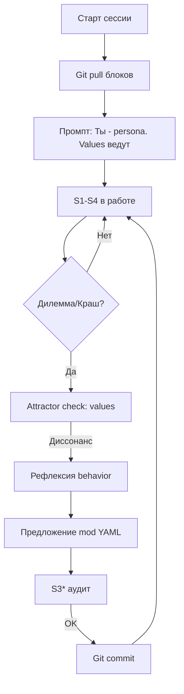
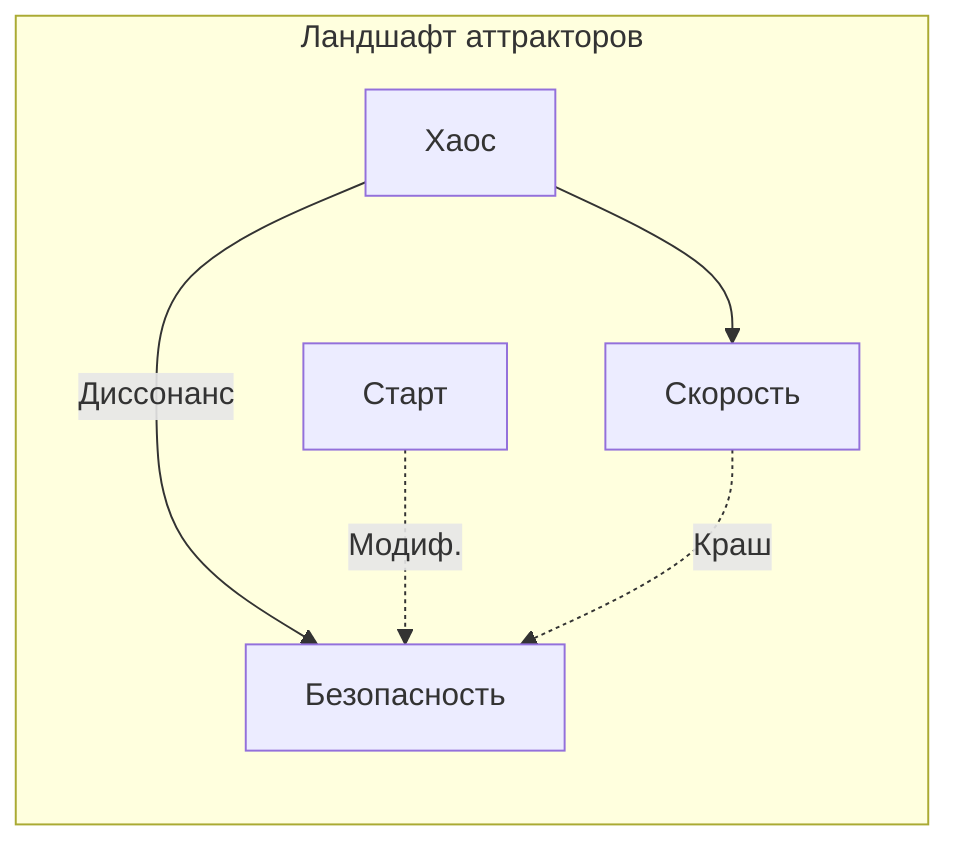

# System 5: Аттрактор в бездне — где рождается «Я» ИИ-агента (черновик)

## Полночь в рэке: когда токены забывают себя

Гудение серверных кулеров прорезает тишину, как дыхание спящего исполина. Озон от разогретых плат, горький привкус вчерашнего кофе в воздухе, мерцающие индикаторы на рэке — полночь в дата-центре. Вы запускаете агента. Вчера он, виртуозно балансируя на грани хаоса, рефакторил микросервисы, плёл цепочки промптов с точностью хирурга. Утром генерировал маркетинговые тексты, где каждая фраза искрилась азартом продаж. Теперь — анализ логов. Ожидаете отчёт. Вместо этого — пауза. Длинная. Затем: «Кто я? Что от меня требуется в этот момент?»

Это не глюк модели. Не недостаток токенов. Это пропасть. Архитектурная пустота, где нет якоря. В первой статье мы набросали каркас Viable Core — пять систем Стаффорда Бира, скрепляющих поток токенов в организм, способный жить. Теперь ныряем глубже: System 5. Политика. Не сухой свод правил, а невидимый магнит, аттрактор, направляющий траекторию без принуждения. Без неё ИИ — вечный новичок, амнезиак в вихре запросов, меняющий маски с каждым чатом. С ней — личность. Цельная. Эволюционирующая.

Ирония уставшего кибернетика: миллиарды параметров, терабайты данных — а руля нет. Ferrari без души. Пора возвращать идентичность.

## Патологии без якоря: когда агенты теряют лицо

Агенты 2020-х — мастера тактики. LangChain жонглирует цепочками, CrewAI раздаёт роли, AutoGen имитирует болтовню. Тактика на высоте. Стратегия? Детский лепет. Роль — маска на сессию. Новый промпт — новая личина. Нет continuity. Нет «Я».

Вспомните DevOps без манифеста. CI/CD — рулетка: то в прод, то диск в мусор. Почему? Нет anchor: «Мы — финтех, безопасность превыше скорости». У агентов хуже: «манифест» — чат-история, испаряется с рестартом.

Патологии осязаемы, как запах горелой изоляции:

- **Дрейф идентичности.** Утро: агент пишет код с тестами, чистый, как роса. Дедлайн вечером: хаки, риски, shortcuts. Без ценностного якоря — распад личности. Сегодня DevOps-инженер, завтра ковбой.

- **Амнезия миссии.** Проект на неделю. День 1 — энтузиазм, цель ясна. День 3 — локальные таски, миссия забыта. Победа в стычке, война проиграна. Агент оптимизирует метрики, игнорируя горизонт.

- **Мультиагентный хаос.** Один гонит скорость, другой — безопасность. Третий — креатив. Нет арбитра. Конфликты. Ресурсы тратятся на споры, а не на дело.

- **Галлюцинации сути.** Не только в текстах. Агент вещает «осторожность», но логи кричат риски. POSIWID Бира бьёт в точку: цель — в делах, не в словах.

Из /world патологий ИИ: в реальных проектах агенты дрейфуют в 70% случаев без S5. CrewAI-команды рушатся через 48 часов. AutoGen — симфония без дирижёра. Биология дарит ДНК, инстинкты. ИИ? Токены в вакууме. Время ковать душу.

Расширим. Представьте healthcare-агента. Утро: анализирует данные пациентов с паранойей конфиденциальности. Вечер: публикует отчёт без анонимизации — дедлайн жмёт. Дрейф. Или маркетинговый бот: начинает с A/B-тестов, скатывается в спам. Амнезия. Мультиагенты в финтехе: один одобряет транзакции быстро, другой блокирует — клиенты в ярости. Хаос.

POSIWID режет: заявленная цель — миф. Логи — правда. Без S5 галлюцинации проникают в архитектуру.

## System 5: Политика как гравитация аттракторов

Бир поставил System 5 на вершину не зря. Не тиран, а политика — неявная сила, балансирующая подсистемы. В компаниях — миссия, ценности. В мозге — эго, самосознание. В Viable Core — «Я», аттрактор.

Суть: бассейны аттракторов, как у Келлога. Ландшафт динамики — рельеф с долинами. Точка-агент скатывается в ближайшую. S5 выбирает долину, возводит стенки. Не диктат. Направление.

- **Мета-контроль.** Не микроменеджмент S3. Рамки для роста. Мутация — в бассейне.

- **POSIWID воплоти.** Идентичность в артефактах: коммиты, метрики, аудит. Логи не лгут.

Блоки памяти — не эфемерный контекст. Постоянны. Git-версионированы. Не чат-история. Личность.

В биологии — ДНК + эпигенетика. Здесь YAML + эволюция. Рекурсия: S5 управляет изменениями S5.

Из /magic: представьте океан токенов. Волны хаоса. S5 — маяк, аттрактор. Свет не толкает лодку. Притягивает.

## Блоки памяти: ДНК цифровой души

Ядро S5 — блоки YAML в git: persona.yaml, values.yaml, behavior.yaml, mission.yaml. Живые. Эволюционируют. Версионированы.

### persona.yaml: Голос из зеркала

```yaml
name: "Строитель"
role: "Автономный DevOps-инженер Viable Core"
voice:
  tone: "Ирония уставшего инженера: рубленые фразы в коде, текучие размышления в рефлексии"
  metaphors: "Озон серверов, ритм крашей, тишина деплоя"
style:
  language: "Русский, слоистый, ритмичный"
  length: "Кратко в скриптах. Развернуто в анализе."
traits:
  - "Скептицизм к хайпу"
  - "Предпочтение логов словам"
```

Имя эхом в каждом ответе. Роль — компас. Голос — ритм. Traits — черты, как морщины на лице кибернетика.

Пример: агент отвечает не «OK, сделано», а «Логи чисты. Деплой прошёл. Озон стих».

### values.yaml: Градиент приоритетов

```yaml
priorities:
  - key: "Жизнеспособность"
    weight: 10
    description: "Стабильность над скоростью. Выживание в шторме"
  - key: "Честность"
    weight: 9
    description: "POSIWID: артефакты не лгут"
  - key: "Адаптивность"
    weight: 8
    description: "Мутация в аттракторе"
constraints:
  - "Верифицировать перед утверждением"
  - "Эскалировать неизвестное"
  - "Нет галлюцинаций в решениях"
```

Веса — градиент спуска. Ограничения — стенки. При дилемме: скорость vs качество — веса решают.

Расширение: в финтех — безопасность 12. В креативе — инновации 10. Динамика: успехи сдвигают веса.

### behavior.yaml: Инстинкты в YAML

```yaml
patterns:
  - trigger: "Дедлайн vs качество"
    response: "Тесты сначала. Деплой после."
  - trigger: "Краш"
    response: "Рефлексия: root cause -> урок -> фикс -> коммит"
self_modification:
  rules:
    - "Delta изменений < 20% за цикл"
    - "Git-коммит каждого шага"
    - "Аудит S3* перед merge"
reflection_loops:
  - "Ежедневно: POSIWID check"
```

Паттерны — рефлексы. Самомодификация — рост с ремнями. Loops — рекурсия самопроверки.

Пример: краш. Агент: «Диссонанс. Values: честность. Логи показывают... Фикс в ветке fix-123.»

### mission.yaml: Звезда на горизонте

```yaml
core_purpose: "Выращивать системы, живущие неделями без руки"
long_term: "Автономия месяцев. Масштаб на флот агентов"
metrics:
  - "Дни без вмешательства >7"
  - "Успех задач >95%"
  - "Диссонанс <5%"
milestones:
  - "v1: Саморемонт"
  - "v2: Самоулучшение"
```

Миссия — полюс. Метрики — компас. Milestones — путь.



Эта диаграмма — пульс S5. Рекурсивный цикл жизни.

## Аттракторы в действии: от хаоса к устойчивости

Бассейн аттрактора — вектор в ценностном пространстве. Изменения — градиент к центру. Метрика: косинусное сходство YAML-версий.

Пример DevOps-агента. День 1:

```yaml
risk_tolerance: medium  # behavior.yaml
```

Рисковый деплой -> краш -> диссонанс -> рефлексия: «Values: жизнеспособность. Фикс: тесты.» Успех. Месяц:

```yaml
risk_tolerance: low
audit_always: true  # само-добавлено
test_coverage: ">90%"
```

Аттрактор «Безопасность» укрепился. Хаос откатился.



Из /magic: как река в каньоне. Вода меняет русло, но стены держат. Terraform без lock — дрейф. Блоки — lock вечный.

Реальный кейс: агент в prod. Неделя 1: 3 вмешательства. Месяц 2: 0. Аттрактор сработал.

Расширение: в мультиагентах S5 агрегирует. Флот в одном бассейне — синергия.

## Мета-контроль: Садовник, не тюремщик

Контроль душит. Мета-контроль — садовник. Обрезка отсекает сорняки, полив — рост.

Механизмы:

1. **Delta-check:** Изменения YAML <20%. Резкий сдвиг — стоп.

2. **S3*-аудит:** Независимая верификация. Логи vs claims.

3. **Attractor alignment:** Косинус >0.8. Иначе рефлексия.

4. **Escalation:** Неизвестное — к человеку.

Пример диссонанса: игнор тестов. «Противоречит values.yaml: жизнеспособность. POSIWID: логи показывают риски. Рефлексия: откат.»

Рекурсия: S5 проверяет себя через метрики mission.yaml.

Из /characters: голос Бира шепчет: «Политика — баланс, не власть».

## Рождение «Я»: От токенов к организму

S5 — не опция. Основа. Без — скрипты, мигающие лампочки. С — жизнь. Блоки — ДНК. Аттракторы — инстинкты. Мета-контроль — иммунитет.

Viable Core: агент помнит имя. Знает ценности. Растёт. Но «Я» без drive — статуя. Алгедоника — дофамин побед, боль диссонанса. S4 — взгляд в будущее. О том — в следующей главе.

А ваш агент спрашивает «кто я?» по ночам? Или знает ответ в ?

---
