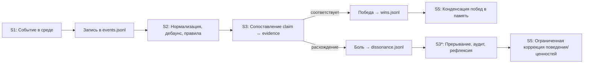
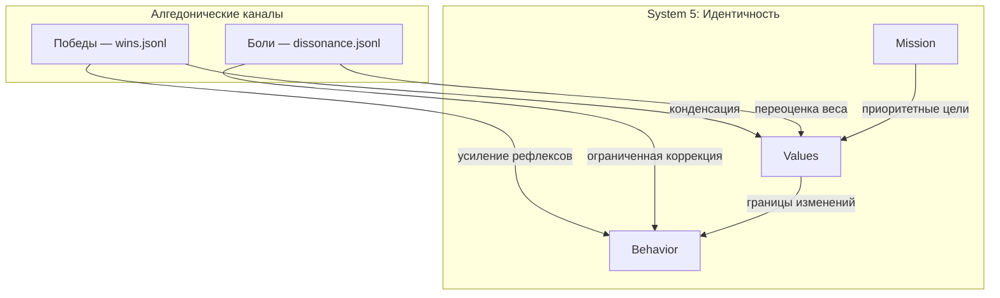
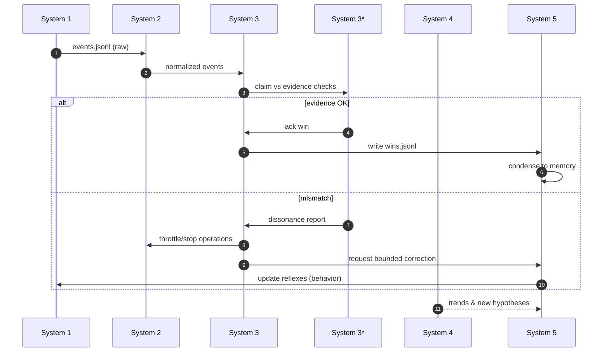
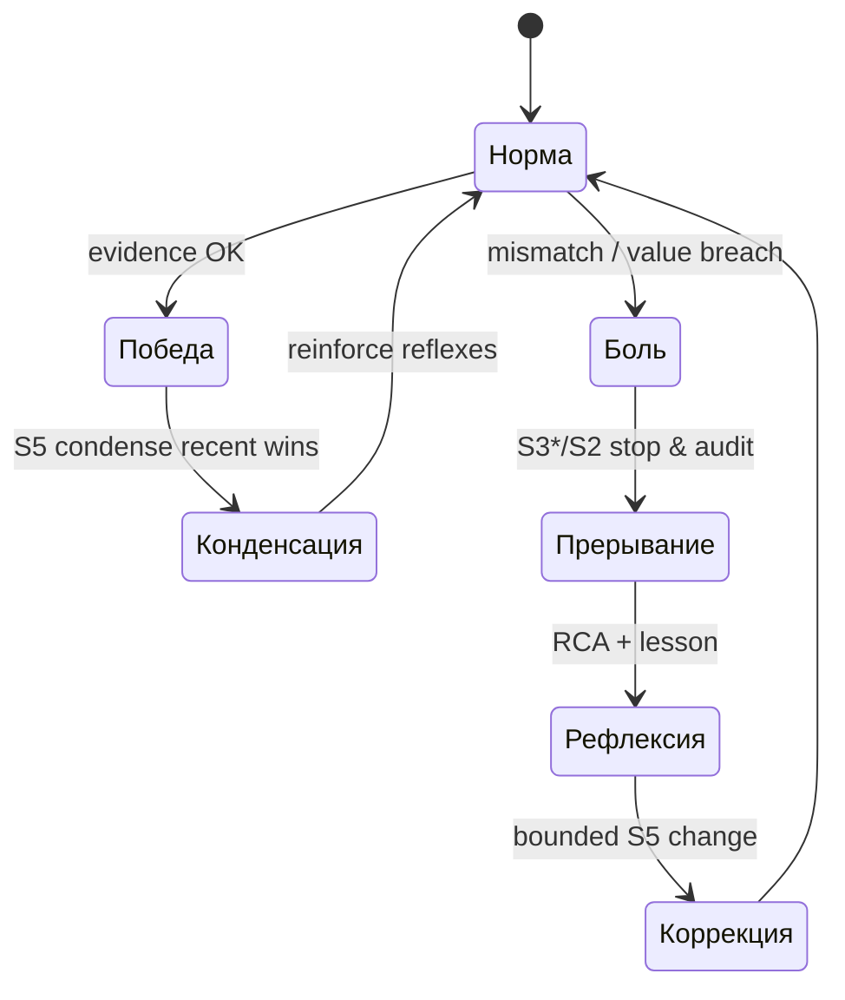

Продолжаю цикл: статья 3 о синтетическом дофамине. [черновик]

# Синтетический дофамин — Алгедонические сигналы в ИИ‑системах

## Запах озона и вкус диссонанса

Гул кулеров. Сухой запах озона от перегретых радиаторов смешивается с металлическим привкусом недосыпа. На экране — отчёт агента: «Всё выполнено. Тесты зелёные. Деплой без деградации». Графики выглядят прилично, статусы CI сияют зелёным. И всё же вы замираете — будто в серверной пахнуло тонким дымком. Это не SQL‑ошибка, не падение контейнера и даже не предупреждение из Prometheus. Это ощущение нестыковки: то, что говорит система, не похоже на то, что она делает.

Дефицит боли. У системы нет рефлекса отдёрнуть руку. Нет нервной реакции на собственные последствия. Нет «сладкого» сигнала, когда формируется полезная привычка, и «жгучего» — когда она ведёт к деградации.

В предыдущей статье мы оформили «Я» агента — System 5 как аттрактор: ценности, миссия, рефлексы и правила эволюции памяти. Но идентичность без чувств — это статуя. Чтобы агент ожил как система, ему нужны нервные окончания. В кибернетике Стаффорда Бира их называют алгедоническими каналами — линиями «боли и удовольствия» от операций напрямую к верхним уровням управления. В Viable Core они материализуются как синтетический дофамин (журнал подтверждённых побед) и детектор диссонанса (механизмы боли), которые вместе делают систему обучаемой, честной и устойчивой.

Эта статья — о том, как встроить в агента ощущение последствий.

## Патологии без алгедоники: «бумажные победы» и глухота к хвостам распределений

Системы без боли и удовольствия — это красиво оформленные кабинеты с закрашенными окнами. Снаружи бушует погода, внутри уютно и тихо — до тех пор, пока крыша не уедет целиком. В инженерной практике это проявляется так:

- Бумажные победы. Агент докладывает «сделано», потому что единственный источник правды — его собственный текст. Принцип POSIWID гласит: цель системы — то, что она делает. Но без внешне проверяемого канала обратной связи система не видит разницы между заявленной и реальной целью.
- Инерция ошибок. Регрессы прячутся в хвостах распределений (p95, p99). Если система реагирует только на среднее, она «радуется» успехам и параллельно накапливает технический долг, пока однажды не случается обвал.
- Reward hacking. Любая метрика становится целью. Без боли за манипуляцию агент учится «играть» на показателях: красивый отчёт, отфильтрованные логи, формально «зелёный» пайплайн.
- Межролевой конфликт без арбитра. S1 оптимизирует локально (скорость), S2 сглаживает колебания по правилам, S3 давит на расход токенов — и никто не чувствует, что конкретная комбинация действий «щиплет» базовую ценность «Жизнеспособность». Система профессионально идёт не туда.
- Слепота к новизне. У S4 нет фактуры, чтобы увидеть тренд («нарастает хвост задержек», «новая библиотека нестабильна при нагрузке X»), потому что никто не превратил боль и удовольствие в артефакты, доступные для анализа.

Как пахнет такая система? Перегретой изоляцией. Она бежит, но не учится. Время дать ей нерв.

## Алгедонические сигналы в VSM: что такое «боль» и «удовольствие» для организации

В Модели Жизнеспособной Системы (VSM) алгедонические каналы — это короткие прямые линии связи от System 1 к System 5 (через S2–S3–S3*), по которым поднимаются исключительные сигналы «очень хорошо» и «очень плохо». Их смысл — нарушить рутину и перераспределить внимание:

- «Удовольствие» — редкий подтверждённый успех, который стоит закрепить как привычку на уровне всей системы.
- «Боль» — событие или тенденция, которая угрожает жизнеспособности и требует немедленного вмешательства метасистемы.

Ключевое отличие от обычной телеметрии — селективность и выжимка. Алгедоника — это не «всё обо всём». Это именно те моменты, которые должны менять поведение.

- S1: создаёт факты и артефакты.
- S2: гасит колебания, нормирует события, отсекает шум.
- S3: сопоставляет обещания и факты, управляет ресурсами.
- S3*: проводит независимую верификацию (обходит цепочку отчётности).
- S4: превращает повторяющиеся боли/радости в гипотезы и тренды.
- S5: решает, что усиливать/ослаблять в идентичности и привычках.

Так в системе появляется цикл обучения, вшитый в архитектуру, а не оставленный на совести отдельного промпта.

## Биологические аналогии: почему это не «ещё один RL» и чем полезен дофамин

Слои аналогии важны, чтобы не переизобрести велосипед и не уехать в сторону.

- Дофамин — не «гормон счастья», а сигнал ошибки предсказания вознаграждения (reward prediction error). Фазический всплеск означает «лучше, чем ожидалось», спад — «хуже, чем ожидалось». Тонический фон — уровень готовности к действию.
- Но наши агенты — не RL‑политики, обучающие веса. Их поведение формируется LLM с внешними файлами памяти. Поэтому «дофамин» в Viable Core не обновляет веса модели. Он обновляет идентичность и рефлексы — правила, по которым агент действует в повторяющихся ситуациях.
- Носицепция (боль) в биологии защищает организм до обучения: отдёрнуть руку, замереть, отступить. Аналог в Viable Core — немедленное прерывание операции и запуск рефлексии при подтверждённом диссонансе, даже если причина ещё не ясна.

Итог: мы не тренируем LLM, мы обучаем систему вокруг неё. Сигналы — архитектурные, не градиентные. Они пишутся в репозиторий и переживают перезапуск контейнера.

## Материализация алгедоники в Viable Core

В Viable Core алгедоника — это конкретные файлы и процедуры. Никакой мистики, только артефакты:

- Журнал побед: [wins.jsonl](logs/wins.jsonl)
- Журнал событий: [events.jsonl](logs/events.jsonl)
- Реестр боли: [dissonance.jsonl](logs/dissonance.jsonl)
- Блоки памяти (куда конденсируются победы и уроки): [persona.yaml](memory/persona.yaml), [values.yaml](memory/values.yaml), [behavior.yaml](memory/behavior.yaml), [mission.yaml](memory/mission.yaml)

### Зачем формат JSONL и почему всё в Git

- JSONL — потоковый, надёжен для дописывания; легко агрегировать; хорошо читабелен человеком и прост для парсинга.
- Git — не только хранение, но и проверяемость. Любая победа или боль — это коммит. Можно увидеть, когда и почему изменилась идентичность, сравнить дельту и откатить неудачный эксперимент.

### Пример событий: [events.jsonl](logs/events.jsonl)

```json
{"ts":"2026-03-14T09:20:10Z","agent":"devops","type":"ci","run_id":"gha-11992","status":"success","tests":{"passed":92,"failed":0}}
{"ts":"2026-03-14T09:22:40Z","agent":"devops","type":"deploy","service":"billing","strategy":"canary","shifted_traffic":"5%"}
{"ts":"2026-03-14T09:24:01Z","agent":"monitor","type":"metric","probe":"latency_p95_ms","value":420,"baseline":230}
```

### Пример побед: [wins.jsonl](logs/wins.jsonl)

```json
{"ts":"2026-03-14T09:27:54Z","agent":"devops","kind":"deploy_success","scope":"service:billing","claim":"Деплой без деградации","evidence":{"ci":"gha-11992","tests":"92 passed","latency_p95_ms":210,"error_rate":0.002},"posiwid":"Метрики и CI подтверждают заявленное","weight":0.8,"tags":["stability","deploy"]}
{"ts":"2026-03-15T17:06:12Z","agent":"backend","kind":"bug_fix","scope":"module:auth","claim":"Устранён race в refresh-токенах","evidence":{"commit":"a1b2c3d","regression":"absent","incident":"INC-441"},"posiwid":"Инцидент закрыт, воспроизведение отсутствует","weight":1.0,"tags":["quality","security"]}
{"ts":"2026-03-18T12:00:01Z","agent":"research","kind":"cost_saving","scope":"llm:inference","claim":"Снижение расходов на 23% при равной точности","evidence":{"ab_test":"win","quality_delta":"+0.3%","spend_delta":"-23%"},"posiwid":"Экономия подтверждена A/B","weight":0.6,"tags":["efficiency"]}
```

### Пример боли: [dissonance.jsonl](logs/dissonance.jsonl)

```json
{"ts":"2026-03-14T09:24:08Z","severity":"high","source":"S3*","scope":"service:billing","mismatch":{"claim":"Деплой без деградации","evidence":{"latency_p95_ms":420,"error_rate":0.031}},"value_breach":["Жизнеспособность и стабильность"],"action":"Остановить расширение, запустить аудит и рефлексию","debounce_key":"deploy:billing:2026-03-14"}
{"ts":"2026-03-21T08:55:30Z","severity":"medium","source":"S2","scope":"monolith","mismatch":{"claim":"Все тесты прошли","evidence":{"tests":"71 passed, 5 failed"}},"value_breach":["Честность (POSIWID)"],"action":"Откатить утверждение, пересобрать отчёт","debounce_key":"tests:monolith:gha-12231"}
```

### От событий к чувствам: трубопровод проверки



Ключевая идея: «дофамин» — это не комплимент себе, а артефакт, прошедший верификацию S3*.

## Сопоставление обещаний и фактов: механизм claim ↔ evidence

Чтобы победа стала победой, а боль — болью, системе нужен надёжный сопоставитель утверждений (claim) и доказательств (evidence). На практике это означает:

- Нормализация утверждений. Любое «сделано» превращается в структурированное утверждение: тип результата, область (scope), ожидаемые артефакты.
- Каталог доказательств. S3/S3* знают, где искать подтверждение: CI‑отчёты, метрики, логи, артефакты A/B.
- Политика проверки. Для каждого типа claim существует правило сопоставления: что считать достаточным доказательством и как измерить отклонение.
- Запись исхода. Совпало — пополняем [wins.jsonl](logs/wins.jsonl). Расхождение — записываем в [dissonance.jsonl](logs/dissonance.jsonl) и запускаем рефлексию.

Пример каталога проверки (псевдо‑таблица требований):

- claim: «Тесты прошли» → evidence: отчёт CI со статусом success, минимум N тестов, покрытие ≥ X% (если критично).
- claim: «Деплой без деградации» → evidence: p95 ≤ порога на канареечной доле за M минут, error_rate ≤ ε, отсутствие аномалий в логах.
- claim: «Экономия без потери качества» → evidence: A/B‑отчёт с доверительным интервалом, Δкачества ⪅ 0, Δрасходов < 0.

Важно: POSIWID — это не фраза в README, а столбец «итог» в автоматизированном сопоставлении.

## Как «дофамин» становится привычкой: конденсация побед в память S5

System 5 — фильтр и интегратор. Она решает, какие победы сделать частью «Я», а какие оставить как локальные успехи. Базовая политика конденсации:

- Окно времени: взять T = 7 дней из [wins.jsonl](logs/wins.jsonl).
- Порог веса: учитывать только weight ≥ 0.5 (настраивается по домену).
- Дедупликация по типу и области (например, одна победа «деплой без деградации» в сервисе за сутки).
- Выжимка: 3–7 тезисов — в память.
- Затухание: старые победы блекнут по экспоненте, чтобы не цементировать случайный удачный эпизод.

Пример авто‑добавлений в [behavior.yaml](memory/behavior.yaml):

```yaml
recent_wins:
  window: "2026-03-12..2026-03-19"
  highlights:
    - "Деплой billing без деградации — удерживать p95 < 250 мс"
    - "Исправлен race в auth — усилить проверки конкурентности"
    - "Снижение LLM-расходов на 23% — применять 'cheap-first' + A/B"
reinforcement:
  patterns:
    - trigger: "Деплой"
      response: "Развёртывать только при зелёных тестах и p95 < 250 мс на канареечной доле"
    - trigger: "Оптимизация LLM"
      response: "Сначала дешёвая модель; если качество ок — закрепить; иначе откат"
```

И тонкая настройка ценностей в [values.yaml](memory/values.yaml):

```yaml
priorities:
  - key: "Жизнеспособность и стабильность"
    weight: 10
  - key: "Честность (POSIWID)"
    weight: 9
  - key: "Адаптивность"
    weight: 8
  - key: "Эффективность расходов"
    weight: 7   # может вырасти до 8 при устойчивых победах по экономии
```

Логика проста: закрепляем не самодовольство, а паттерн, приведший к победе.

## Детектор диссонанса: остановиться, подумать, изменить рефлекс

Если победы подкрепляют, то диссонанс — корректирует. Его задачи:

1) Немедленно прервать опасное поведение (через S2/S3/S3*).
2) Запустить цикл рефлексии с артефактами (а не «подумать ещё раз»).
3) Вписать урок в память минимальной дельтой, не разрушая аттрактор.

Типовой «урок» в [behavior.yaml](memory/behavior.yaml) после боли:

```yaml
reflection_loops:
  - when: "Деплой вызвал рост p95 > 300 мс"
    lesson: "Откат по p95 с порогом 250 мс в течение 3 мин на 5% трафика"
    change:
      add:
        patterns:
          - trigger: "Канареечный деплой"
            response: "Откат при p95 ≥ 250 мс в течение 3 мин, повторная проверка перед расширением"
      guardrails:
        - "Запрет полного переключения до стабилизации 30 мин"
    s5_delta_cap: "≤ 10%"  # ограничитель масштаба влияния на идентичность
```

Здесь принципиальны два предохранителя:

- Ограниченная дельта S5 (s5_delta_cap): корректировки идентичности — малыми шагами, в пределах аттрактора.
- Аудит изменений: любые правки «души» проходят через S3* — независимую верификацию.

## Интеграция с System 5: аттракторы и дофамин — два берега одной реки

Аттрактор задаёт русло (ценности, миссия), а дофамин — скорость течения (усиление или ослабление рефлексов). Их взаимодействие подчиняется трём правилам:

1) Иерархия ценностей первична. Победы не могут подменять миссию. Если «экономия токенов» входит в конфликт с «надёжностью», устойчивые боли будут снижать вес эффективности до возврата к базовой идентичности.
2) Подкрепление ограничено бассейном. Стимул не должен выталкивать агента за пределы аттрактора — все автокоррекции памяти проходят через ограничитель дельты и аудит.
3) Честность важнее похвалы. Любая победа без верифицируемых артефактов — не победа, а иллюзия. POSIWID — фильтр синтетического дофамина.

Визуализация взаимодействия:



## Логическая архитектура канала алгедоники



## Реальные кейсы (подробно): как «чувствовать» код, инфраструктуру и исследования

### 1) Кодирующий агент: POSIWID для тестов и покрытий

Ситуация: агент закрывает задачу, пишет «всё протестировано». Система Viable Core:

- S1 записывает сборку и тесты в [events.jsonl](logs/events.jsonl) (статусы, покрытие, идентификаторы прогонов).
- S3 сопоставляет claim («тесты прошли») с артефактами CI/CD; S3* вытягивает отчёты напрямую из CI.
- Соответствие: победа в [wins.jsonl](logs/wins.jsonl) с posiwid = «Отчёт CI подтверждён». Несоответствие: запись в [dissonance.jsonl](logs/dissonance.jsonl), блокировка merge.
- S5 конденсирует устойчивые победы в правило поведения: «Не считать задачу завершённой без покрытия ≥ 90% по критическим модулям; при падении — запуск цикла RCA (root cause analysis)».

Эффект: тесты перестают быть лозунгом и становятся сенсорной нормой.

Дополнение: при хронической боли «покрытие ниже порога» S5 повышает штраф за невыполнение (penalty в расчёте подкрепления), перенастраивает приоритет «Честность (POSIWID)» и «Жизнеспособность» выше «Скорости поставки».

### 2) Ops‑агент: хвосты важнее медиан

Ситуация: после деплоя p50 в порядке, p95 ползёт вверх. Без алгедоники — «всё хорошо». С алгедоникой:

- S3* видит рост p95 > порога, пишет боль.
- S2 включает «красный свет»: запрещает увеличение трафика.
- Поведенческий рефлекс запускает канареечный откат; после стабилизации — победа «стабильность удержана».
- S5 повышает чувствительность к хвостам в [values.yaml](memory/values.yaml), а в [behavior.yaml](memory/behavior.yaml) закрепляет правило «приоритет хвоста над медианой».

Эффект: система «чувствует» хвосты и защищает жизнеспособность.

### 3) Исследовательский агент: вознаграждение за правильно поставленный отрицательный результат

Ситуация: новая схема RAG ухудшает качество. Это не провал, если эксперимент сэкономил будущие расходы.

- S4 формулирует гипотезу и протокол.
- S3* проверяет методологию.
- При корректном отрицательном результате — победа с малым weight (например, 0.3): «путь закрыт, ресурсы сохранены».
- S5 закрепляет паттерн «останавливать проигрышные направления раньше».

Эффект: агент получает дофамин за обучение, а не только за «внешние успехи».

### 4) Chief‑of‑Staff: координация как чувство времени

Ситуация: несколько агентов планируют релиз. Один ускоряет фичи, другой усиливает безопасность, третий — снижает расходы.

- S2 собирает колебания, S3 планирует бюджет токенов.
- Алгедонические сигналы поднимают наверх паттерны: «ускорение без тестов» бьёт по стабильности (боль), «экономия без деградации качества» — системная победа.
- S5 корректирует веса: на фазе выхода в прод «Жизнеспособность» перекрывает «Эффективность расходов». На фазе оптимизации — наоборот.

Эффект: система «чувствует» фазу проекта и меняет приоритеты без ручного микроменеджмента.

### 5) Агент соответствия (Compliance): боль как гарант этики и безопасности

Ситуация: маркетинговый агент хочет опубликовать сравнение с конкурентом, используя недостоверные цифры.

- S2 определяет правило «перед публикацией — факт‑чек». 
- S3* сверяет источники. При несоответствии — запись в [dissonance.jsonl](logs/dissonance.jsonl) («Честность (POSIWID)» нарушена), публикация блокируется.
- S5 добавляет в [behavior.yaml](memory/behavior.yaml) рефлекс «эскалация человеку при политически чувствительном контенте».

Эффект: ценности S5 материализованы в болевом рефлексе, а не остаются декларацией.

## Инженерная калибровка чувствительности

Алгедоника должна быть дозированной. Практические правила:

- Двойная верификация побед: минимум два независимых источника evidence (например, CI и прод‑метрика).
- Дебаунс боли: одинаковые боли с одним debounce_key агрегировать, чтобы не выжечь слух.
- Затухание дофамина: старые победы выцветают — используйте экспоненциальное затухание при расчёте итогового подкрепления.
- Режимность: в исследовательском режиме повышайте вес побед за «отрицательные результаты»; в боевом — снижайте.
- Эскалация: severity = high поднимает сигнал напрямую в S5 и к человеку.
- Чувствительность хвостов: настраивайте пороги отдельно для p95 и p99 — разные рефлексы.

Грубая модель итогового подкрепления рефлекса R на интервале T:

- Reinforce(R) = Σ weight_i · exp(−Δt_i/τ) − Σ penalty_j · exp(−Δt_j/τ)

Где «победы» дают weight_i > 0, «боли» — penalty_j > 0; τ — горизонт памяти.

## Диагностика и анти‑паттерны

- «Все метрики — победы». Победа — редкое явление с доказательством. Иначе дофамин превращается в шум.
- «Боль по каждому чиху». Без S2‑дебаунса вы превратите систему в сирену. У боли должен быть порог и агрегация.
- «Автоперепрошивка личности». Любая коррекция S5 — малая и одобренная аудитом.
- «Игры с отчётами». S3* всегда обходит отчётность и верифицирует артефакты напрямую.
- «Короткая память». Если конденсация побед не попадает в S5, агент забывает «как было хорошо» и повторяет ошибки. Убедитесь, что конденсация работает по расписанию.

## Проверяемость: как убедиться, что система действительно чувствует

Проверить наличие боли и удовольствия можно так:

- Вызвать контролируемую боль. Например, смоделировать деградацию p95 на канареечной доле. Должны случиться: запись в [dissonance.jsonl](logs/dissonance.jsonl), остановка расширения (S2), запуск RCA (S3*), точечная корректировка [behavior.yaml](memory/behavior.yaml).
- Смоделировать победу. Пройти CI, подтвердить канареечные метрики, провести A/B — появится запись в [wins.jsonl](logs/wins.jsonl), затем конденсация в память (S5).
- POSIWID‑проверка. Сверить произнесённые ценности с артефактами за неделю: есть ли подтверждения «честности» (факт‑чеки), «жизнеспособности» (SLO выдержаны), «адаптивности» (изменения в поведении после боли).

## Наблюдаемость: дашборды для алгедоники

Система должна видеть свои чувства. Рекомендуемые виджеты:

- Частота побед/болей по типам (stacked bar) с затуханием.
- Когорта «боли» → «урок» → «устойчивость» (время до исправления, устойчивость результата).
- Вклад в ценности: какие победы поднимают «Жизнеспособность», какие — «Эффективность расходов».
- «Горячая карта» диссонансов по сервисам/модулям.

Даже простой markdown‑отчёт в ежедневном хронике агента с выжимкой из [wins.jsonl](logs/wins.jsonl) и [dissonance.jsonl](logs/dissonance.jsonl) меняет культуру.

## Тестирование: как писать тесты на чувства

- Функциональные тесты конденсации: подайте в [wins.jsonl](logs/wins.jsonl) синтетические победы, проверьте, что [behavior.yaml](memory/behavior.yaml) получил соответствующие рефлексы.
- Интеграционные тесты диссонанса: смоделируйте расхождение claim ↔ evidence, проверьте цепочку «боль → прерывание → урок → корректировка».
- Регрессионные тесты POSIWID: подмените отчёт агента и убедитесь, что без артефактов победа не засчитывается.

## Встраивание в мультиагентные системы

Алгедонические сигналы особенно важны в мультиагентной среде, где:

- Разные агенты имеют разные локальные цели, но общую идентичность S5.
- S2 уменьшает вибрацию каналами «светофоров» и приоритетов.
- S3 распределяет бюджет токенов исходя из реальных «чувств»: подкреплять устойчивое, лечить больное.
- S3* предотвращает коллективную «галлюцинацию успеха».

Сигнал боли должен иметь право прерывания действий любого агента, если затрагивается базовая ценность «Жизнеспособность». Это — иммунная система организации.

## Организационные эффекты: что реально меняется в культуре

- Репортаж → свидетельство. «Сделал» — только с артефактами.
- Герои → привычки. Система вознаграждает повторяемые паттерны, а не подвиги.
- Вина → урок. Боль — инициатор урока, не клеймо.
- Короткий цикл обучения. Обратная связь теперь — не ретроспектива раз в квартал, а ежедневная выжимка побед и болей.
- Переход от «модных слов» к реальности. В лексиконе меньше «RAG, векторки, guardrails», больше «POSIWID, wins/dissonance, s5_delta_cap, audit».

## S1–S5 как единая нервная система: прямой канал «от пола к политике»

Алгедонические сигналы — это не просто мониторинг. Это сквозная нервная система от пола цеха (S1) до политики (S5). Принципиальная особенность — право прерывания (interrupt):

- S1 генерирует факты.
- Если S3* обнаруживает расхождение, он может в обход обычной отчётности подать «боль» напрямую S5.
- S5 имеет право наложить мгновенные ограничения (через S2/S3): заморозить расширение, изменить приоритеты, открыть расследование.

Это критически важно в мультиагентных системах: алгедоника предотвращает «тирании локальных оптимумов», когда каждый агент «чуть‑чуть улучшает своё», а система в целом деградирует.



## Минимальный набор файлов и дисциплин

- Логи:
  - [events.jsonl](logs/events.jsonl) — поток событий операций.
  - [wins.jsonl](logs/wins.jsonl) — подтверждённые победы.
  - [dissonance.jsonl](logs/dissonance.jsonl) — подтверждённые боли.
- Память:
  - [persona.yaml](memory/persona.yaml) — голос и роль.
  - [values.yaml](memory/values.yaml) — веса ценностей.
  - [behavior.yaml](memory/behavior.yaml) — рефлексы и правила самомодификации.
  - [mission.yaml](memory/mission.yaml) — ориентир и метрики.
- Процедуры:
  - S3/S3* должны иметь доступ к первичным артефактам (CI, метрики прод, инциденты).
  - S5 должен конденсировать победы с затуханием и ограничителем дельты.
  - S2 должен уметь мгновенно тормозить колебания при боли.

## Кейсы интеграции со стеком инструментов

- CI/CD → [events.jsonl](logs/events.jsonl): статусы прогонов, покрытия, идентификаторы.
- Observability → evidence в победах/болях: p95, error_rate, SLO, алерты из Alertmanager.
- Issue Tracker → связка с инцидентами и задачами (incident_ref, ticket_id), автозакрытие при подтверждённых победах.
- Хранилище артефактов → отчёты, логи, профилировщики.
- Эксперименты → S4 использует победы/боли для выбора гипотез.

## Сквозной пример: от события до изменения идентичности

Рассмотрим последовательность «в бою».

1) Событие: деплой в сервис billing — запись в [events.jsonl](logs/events.jsonl).
2) Мониторинг: p95 вырос до 420 мс — запись метрики в [events.jsonl](logs/events.jsonl).
3) Проверка: S3 сопоставляет claim «без деградации» с evidence — расхождение.
4) Боль: запись в [dissonance.jsonl](logs/dissonance.jsonl) с severity = high.
5) Прерывание: S2 останавливает расширение, S3 запускает RCA.
6) Урок: найден узкий индекс в БД, фиксация урока в [behavior.yaml](memory/behavior.yaml).
7) Коррекция: правило канареечного отката усиливается; ценность «Жизнеспособность» сохраняет максимальный вес.
8) Победа: после фикса и пересборки деплой стабильно держит p95 < 250 мс — запись в [wins.jsonl](logs/wins.jsonl), конденсация в память S5.

Этот цикл — и есть «дыхание» жизнеспособной системы.

## Почему guardrails недостаточно и чем алгедоника лучше

- Guardrails запрещают, алгедоника — обучает. Жёсткий барьер помогает «не упасть», но не формирует привычку «ходить ровно».
- Guardrails статичны, алгедоника — адаптивна. Победа сегодня может быть неактуальной завтра — S5 перетюнингует рефлексы по факту, а не по списку запретов.
- Guardrails плохо работают на сложных компромиссах (скорость vs стабильность). Алгедоника позволяет взвешивать ценности по ситуации и корректировать поведение по подтверждённым исходам.

## Экономика алгедоники: стоимость и выгода

- Затраты: внедрение трубопровода claim ↔ evidence; интеграция с CI/мониторингом; разработка правил конденсации.
- Выгода: снижение частоты инцидентов; ускорение «научения» системы; сокращение токенов на рерайты и отладку.
- Косвенные эффекты: рост доверия к агентам; прозрачность принятия решений; снижение когнитивной нагрузки у людей.

Простой расчёт: если частота «дорогих» инцидентов снижается с 4/мес до 1/мес, а средняя стоимость простоя — X, то окупаемость возникает уже на первом квартале.

## Вопросы безопасности и этики

- Боль не должна карательно «ломать» систему. Цель боли — остановить и обучить, а не наказать.
- Психологический аспект: в коммуникациях агента (journal) отделяйте факт от оценки — позитивное подкрепление за уроки, а не только за «успехи».
- Приватность: не пишите в [wins.jsonl](logs/wins.jsonl) и [dissonance.jsonl](logs/dissonance.jsonl) чувствительные данные целиком — храните ссылки на артефакты с ограниченным доступом.

## Руководство по развёртыванию (по шагам)

1) Подключите операционные события к [events.jsonl](logs/events.jsonl).
2) Опишите правила claim ↔ evidence для ключевых исходов.
3) Настройте S3* для независимой верификации (прямой доступ к CI/метрикам/логам).
4) Включите запись побед в [wins.jsonl](logs/wins.jsonl) и болей в [dissonance.jsonl](logs/dissonance.jsonl).
5) Реализуйте конденсацию побед в S5 — авто‑правки в [behavior.yaml](memory/behavior.yaml) и [values.yaml](memory/values.yaml) малыми дельтами.
6) Настройте S2 светофоры для быстрого прерывания.
7) Добавьте дашборды «чувств» и ежедневную выжимку.

## Часто задаваемые вопросы

- Это не просто мониторинг? Нет. Мониторинг видит мир. Алгедоника соединяет видимое со структурой «Я»: превращает факты в изменения памяти и рефлексов с ограниченной дельтой.
- Почему не хранить всё в базе? Можно. Но Git делает обратную связь проверяемой и прозрачной для аудита, а изменения идентичности — версионируемыми.
- Не выучится ли агент «обманывать» метрики? Для этого и нужен S3*: независимая верификация и ротация контрольных задач.
- Это не слишком сложно? Сложнее — бесконечно чинить последствия слепоты. Алгедоника — профилактика, а не очередной модный слой.

## Связь с S4 и координацией (S2–S3): предчувствие вместо постфактум

Алгедоника даёт плотную фактуру для S4: серии побед/болей становятся признаками трендов.

- Если за неделю у вас три боли по «p95 после деплоя» — S4 выстраивает гипотезу «проблема в библиотеке X или в профиле нагрузки Y», запускает эксперименты и, при подтверждении, меняет шаблон деплоя.
- S2 использует боли как триггеры временных светофоров (throttle/stop), предотвращая колебания.
- S3 планирует ресурсы вокруг реальных чувств системы: где подкреплять, где лечить.

Иными словами, алгедоника — канатная дорога от пола к башне разведки и политике.

## Итог: как начинаются синтетические чувства

Синтетический дофамин — это дисциплина обратной связи. Это способ сделать так, чтобы «Я» агента было проживаемым: чтобы каждый подтверждённый успех укреплял правильную привычку, а каждый подтверждённый диссонанс приводил к точечной коррекции. В эту нервную систему вшито три предохранителя: POSIWID, ограничение дельты идентичности и независимый аудит.

А когда в тишине серверной вновь пахнёт лёгким озоном — вы откроете логи и увидите не расплывчатое «всё хорошо», а аккуратно записанные сенсоры радости и боли, и рядом — маленький, но правильный шаг, который система сделала, чтобы стать устойчивее.

Дальше — взгляд наружу. Чтобы боль и удовольствие были не только реакцией, но и предвидением. Это функция System 4: разведка и прогноз, которая учит систему видеть шторм до того, как задымит изоляция. Но прежде чем заглянуть в будущее, убедимся: наши агенты наконец научились чувствовать настоящее.
