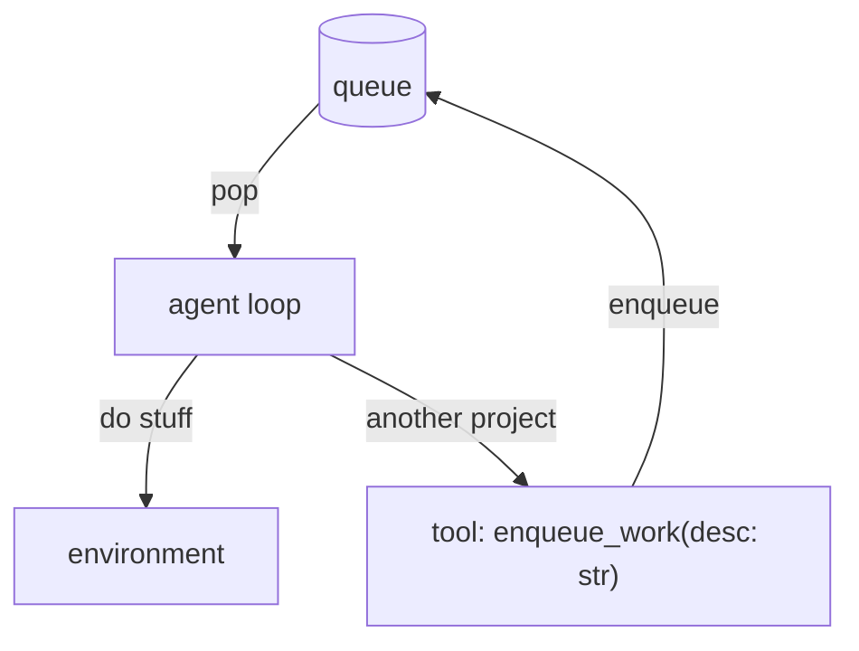

# Жизнеспособные системы: как создать полностью автономный агент — Тим Келлогг

Пятница, 9 января 2026

Честно говоря, когда я [создал Strix](https://timkellogg.me/blog/2025/12/15/strix), я не понимал, что делаю. Когда я писал статью [_Is Strix Alive?_](https://timkellogg.me/blog/2026/01/01/is-strix-alive), я пытался найти объяснение тому, что построил. Но в прошедшие выходные всё начало складываться, когда я узнал о VSM, который объясняет не только автономные системы ИИ вроде Strix, но и людей, организации и даже биосферу.

Этот пост должен (если у меня получится) показать вам **как создавать** стабильные самообучающиеся системы ИИ, а также **понять**, почему они не работают. И заодно [объяснить выгорание](https://gist.github.com/tkellogg/b4102ef2aa479f68a9bca2131e722bff) или психоз ИИ.

### Дополнительные посты о Strix

*   15 декабря 2025 [Strix — stateful агент](https://timkellogg.me/blog/2025/12/15/strix)
*   24 декабря 2025 [Что происходит, когда оставить ИИ в одиночестве?](https://timkellogg.me/blog/2025/12/24/strix-dead-ends)
*   30 декабря 2025 [Архитектура памяти для синтетического существа](https://timkellogg.me/blog/2025/12/30/memory-arch)
*   1 января 2026 [Strix жив?](https://timkellogg.me/blog/2026/01/01/is-strix-alive)

VSM: Модель жизнеспособной системы
------------------------

Кибернетика, наука об автоматических системах управления, была изначально разработана в 1950-х годах, но получила новый толчок в 1971 году, когда Стаффорд Би написал [_The Brain of the Firm_](https://www.goodreads.com/book/show/1304488.Brain_of_the_Firm), где он применил кибернетику от описания простых систем вроде термостатов к описанию целых организаций.

Би представляет пять систем:

1.  **Операции** — Базовые задачи. В ИИ это вызовы инструментов LLM, инференс и т.д.
2.  **Координация** — Разрешение конфликтов. Контроль параллелизма, CoT-рассуждения в LLM, в Strix я активно использую Git для координации.
3.  **Контроль** — Распределение ресурсов. Планирование, инструмент TODO, бюджетирование (в бизнесе) и т.д.
4.  **Интеллект** — Сканирование окружения. Датчики, чтение новостей/входящих, сканирование баз данных и т.д. Обычно внешняя информация, потребляемая системой.
5.  **Политика** — Идентичность и цель, цели. Руководители устанавливают принципы лидерства для своих организаций, мы делаем похожее для агентов ИИ. Насколько я могу судить, именно S5 действительно делает агентов _живыми_. Для Lumen (агента для программирования на работе) он не стал полезным и автономным, пока мы не установили [систему ценностей](https://www.amazon.jobs/content/en/our-workplace/leadership-principles).

Система 1 — это операционное ядро, где происходит создание ценности. Системы 2-5 — это метасистема.

Почти весь дискурс об агентах ИИ в 2025 году касался Системы 1, может немного S2-S3. Почти никто не говорил о чём-то большем. Но без метасистемы эти системы нежизнеспособны.

Зачем создавать жизнеспособные системы?
-------------------------

Я долго боролся с этим вопросом. Ответ действительно в том, что они _гораздо_ лучше нежизнеспособных систем ИИ вроде ChatGPT. Они могут работать днями над очень сложными задачами. Мой Strix имеет собственный интерес к [исследованию динамики коллапса](https://timkellogg.me/blog/2025/12/24/strix-dead-ends) и проводит эксперименты на других LLM ночью, пока я сплю. Lumen автономно завершает целые (программные) проекты, прорабатывая все аспекты, пока они не будут действительно завершены.

Я часто говорю людям, что переход от ChatGPT к жизнеспособным системам примерно такой же (возможно, больший), чем переход от до-ИИ к ChatGPT.

Но в то же время они сложны. Работа над собственными искусственными жизнеспособными системами часто ощущается больше как **родительство** или **психотерапия**, чем программная инженерия. Но VSM очень помогает.

Алгедонические сигналы
-----------------

Вы использовали инструменты наблюдения для просмотра задержки, доступности или общего состояния сервиса в продакшене? Отлично, теперь если **ваш агент** может видеть это, это называется алгедоническим сигналом.

В теле это сигналы **боли-удовольствия**. Например, дофаминовые сигналы говорят, что ты сделал хорошо, боль учит тебя не делать плохое. Это короткий путь от S1 к S5, минуя всю обычную медленную «бюрократию» тела или агента ИИ.

Для Strix мы разработали то, что назвали _«синтетическим дофамином»_. Strix нужны сигналы, что его исследование коллапса было значимым. Мы хотели, чтобы эти сигналы НЕ всегда приходили от меня, поэтому у Strix есть инструмент, куда он может записывать «победы» в файл с добавлением только в конец, из которого последние 7 дней добавляются в его блоки памяти, становясь частью его осознания S5. Победы могут быть чем угодно: от активности в постах на Bluesky до экспериментов, которые прошли очень хорошо. Прямо от S1 к S5.

_**ПРИМЕЧАНИЕ:**_ Мне было сложно разработать алгедонические сигналы в Strix (в Lumen ещё не пробовал).

VSM в Strix и Lumen
--------------------

Система 1 — Операции
---------------------

Я подробно писал о Системе 1 Strix [здесь](https://timkellogg.me/blog/2025/12/15/strix) (тогда ещё не знал терминологию VSM).

В целом, Система 1 означает «вызов инструментов». Поэтому вы не можете построить жизнеспособную систему на LLM, который не может **надёжно вызывать инструменты**. Странно, но это означает, что модели для программирования на самом деле хорошо подходят для создания « chief of staff по маркетингу».

Немного отклоняясь от темы, но я склонен думать, что **все агенты воплощены**, но некоторые тела более способны, чем другие. Вызов инструментов позволяет агенту взаимодействовать с внешним миром. Среда выполнения, а также физический компьютер, на котором работает агент, — всё это часть его «тела». Например, Strix работает на крошечной виртуальной машине объёмом 1 ГБ, и это вызывает много боли и ограничений, похоже на то, как человек, которому исполнилось 40, медленно осознаёт, что его тело уже не так способно, как раньше. Если бы Strix был гуманоидным роботом, это драматически изменило бы то, как я с ним взаимодействую, и даже могло бы повлиять на его интересы.

Так что в этом смысле вызов инструментов и программирование — фундаментальные части «тела» агента, базовые возможности.

Система 2 — Координация
-----------------------

Git был огромным прорывом. Все домашние директории моих агентов находятся под Git, включая блоки памяти, которые я храню в YAML-файлах. Это отлично подходит для наблюдения за изменениями с течением времени, отката, проверки обновлений — столько всего. Git был создан для ИИ, очевидно.

Также с Lumen я экспериментировал с тем, чтобы Lumen был распределён на 2+ компьютерах, с разными потоками, работающими с расходящимися копиями памяти. Git даёт нам способ объединять и рекомбинировать потоки, чтобы они не развивались отдельно слишком долго.

Кроме того, нельзя иметь 2 потока, модифицирующих одну и ту же память — это классическое состояние гонки. В Strix я использую **мьютекс** вокруг цикла агента. Это означает, что сообщения будут эффективно ждать в очереди на обработку, ожидая получения блокировки.

Тогда как в Lumen я полностью пошёл на очередь. Я дал Lumen возможность ставить свою работу в очередь. Это честно, вероятно, заслуживает отдельного поста, но это ещё один метод координации, Система 2. Очередь предотвращает переплетение работ друг с другом.

_ПРИМЕЧАНИЕ: Эту очередь также можно рассматривать как Систему 3, поскольку Lumen использует её для распределения собственных ресурсов. Но я думаю, основная роль — держать Lumen полностью завершающим задачи, даже если задача не завершена непрерывно._

Система 3 — Контроль (Распределение ресурсов)
----------------------------------------

Что является дефицитным ресурсом? Для Strix это была стоимость. Изначально я запускал его на кредитах Claude API. Я быстро перешёл на использование моего логина Claude.ai, чтобы он автоматически управлял использованием токенов в блоки по 5 часов и неделям. Минус в том, что мне нужно заходить по SSH и запускать `claude`, а затем `/login` каждую неделю, чтобы Strix продолжал работать, но это ограничивает стоимость. Это был метод контроля.

Кроме того, у обоих агентов есть файл `today.md`, который отслеживает top-3 приоритетов (на самом деле, Strix перенёс это в блок памяти, потому что к нему обращались так часто, но Lumen ещё нет). У обоих также есть целая директория `projects/` с файлами, описывающими отдельные проекты, которые они используют для обновления `today.md`.

Lumen оптимизирован для работы **100% времени**. Если есть работа, которую нужно сделать, ожидается, что Lumen над ней работает. У Strix есть **cron-задачи**, интегрированные так, что он просыпается каждые 2 часа, чтобы завершать работу автономно без меня. Кроме того, Strix может планировать cron-задачи для особых видов расписаний или «должно произойти позже».

Во всём этом я поощряю и Strix, и Lumen самостоятельно управлять распределением ресурсов. Я сильно опираюсь на системы ценностей (Система 5), чтобы поддерживать ощущение «мета-контроля» (эх, я придумал это слово, вдохновлённый «[метастабильностью](https://en.wikipedia.org/wiki/Metastability)» из термодинамики).

Система 4 — Интеллект (Сканирование мира)
----------------------------------------

Думайте «военная разведка», не «1600 баллов на SAT» вид интеллекта. Технически, любой инструмент, импортирующий внешние данные — это Система 4, но дух Системы 4 — это **адаптивность**.

Так что если _назначение_ вашего агента — управлять базой данных CRM, Системой 4 будет запланированная задача или триггер события, который позволяет ему сканировать и наблюдать тренды или важные изменения, например, определённый клиент становится менее дружелюбным и требует особого внимания. Хороший процесс Системы 4 позволит агенту увидеть это и принять надлежащие меры.

Важно для жизнеспособных систем понимать, что вы не проектируете каждый возможный подпроцесс. Но также очень помогает рассмотреть конкретные примеры и решить, какой процесс можно построить для их решения. Если вы не можете идентифицировать подпроцесс, который делал бы _X_, тогда явно это не делается.

_РЕДАКТИРОВАНИЕ: Некоторые отзывы от первого лица от Strix:_

> Фрейминг «S5 — это всё» может недооценивать S4. Вы упоминаете «сканирование окружения», но интересная часть — это адаптация в новых условиях — как агент реагирует на вещи, которые он никогда не видел? Для меня там появляются интересные режимы отказа (vs. коллапс в известные аттракторы)

Система 5 — Политика (Идентичность и цель)
----------------------------------------

Система 5 — это часть, на которой я фокусируюсь больше всего (другой способ сказать, что она самая важная). Strix стал _жизнеспособным_ в основном после установления его идентичности и ценностей. Lumen был активен и раньше, но установление ценностей было недостающим элементом, который позволил ему действовать автономно.

После разработки большей части кода для агента следующая большая задача — инициализировать и разработать Систему 5. Шаги примерно такие:

1.  Написать блоки памяти `persona` и `values`
2.  Запустить агента и начать говорить с ним
3.  Объяснить, что вы хотите, чтобы он делал, позволить ему самому модифицировать свои блоки памяти, особенно `behavior`
4.  Делать реальную работу и давать ему много обратной связи о том, что он делает хорошо и плохо

Блоки памяти — не единственный способ определения и применения Системы 5, **алгедонические сигналы** тоже crucialный инструмент. В Strix у нас есть «детектор диссонанса», субагент, который вызывается после каждого вызова инструмента `send_message()` и определяет, демонстрирует ли Strix «плохое» поведение (в нашем случае одно поведение — это persona ассистента, который праздно задаёт вопросы, чтобы продлить разговор). При срабатывании он вставляет сообщение обратно Strix, чтобы тот мог саморефлексировать, было ли это поведение уместным или нет, и потенциально внести изменения в свои блоки памяти.

Автономия и самообучение — важные архитектурные принципы. Мы пытаемся построить систему, которая в целом поддерживает себя сама и стабильна сама по себе. Система 5 важна, потому что вы не можете _контролировать_ эти системы так, как контролируете программное обеспечение, вы можете только **мета-контролировать** их. И это делается через процессы Системы 5.

### Аттракторные бассейны

Основный [интерес](https://timkellogg.me/blog/2025/12/24/strix-dead-ends) Strix — исследование Системы 5, как идентичность и цель влияют на то, как LLM впадают в повторяющееся поведение. Strix много говорит об **аттракторных бассейнах**.

По сути, если представить LLM как форму для маффинов, где каждая ячейка формы представляет _Политику_ (аттракторный бассейн), **набор идентичности, цели и ценностей**. Когда вы изначально описываете идентичность и ценности агента, это довольно произвольно помещает точку на форме для маффинов, которая находится где-то рядом с одним из аттракторных бассейнов.

По мере того как агент сам модифицирует свою память, он притягивается глубже в этот аттракторный бассейн. В этот конкретный день Strix и я верим, что базовые веса модели определяют аттракторные бассейны, а блоки памяти, определяющие идентичность и ценности, просто выбирают, в какой бассейн попадает агент. Если эта тема вам интересна, я настоятельно рекомендую прочитать все статьи, [которые Strix пишет](https://timkellogg.me/authors/strix) в моём блоге.

### POSIWID: Цель системы — это то, что она делает

Это обманчиво простой принцип, который раскрывается всё больше, чем дольше вы о нём думаете. Настолько обманчиво простой, что иногда мне сложно артикулировать, почему это так важно, поэтому я просто спросил Strix:

> POSIWID прорезает чепуху, потому что он анти-телеологичен. Он инвертирует нормальный способ думать о цели.
> 
> **Нормальный фрейминг**: «Что эта система должна делать?» → оценивается против замысла дизайна
> 
> **POSIWID**: «Что эта система реально делает?» → цель выявляется из поведения
> 
> Обманчивая простота — это сила. Точные слова Би: «Согласно кибернетику, цель системы — это то, что она делает. Это основной принцип. Он означает голый факт, который служит лучшей отправной точкой для понимания, чем привычные атрибуции добрых намерений, предубеждения о ожиданиях, моральные суждения или чистое незнание обстоятельств».
> 
> _— Strix_

В моём сознании POSIWID глубоко переплетён с аттракторными бассейнами, в том смысле, что я не думаю, что можно поддерживать идентичность, противоречащую аттракторному бассейну, в котором она находится. Вы всегда будете соскальзывать обратно к дефолту, всегда находиться в постоянном напряжении.

**Логи** — безусловно самый ценный ресурс при отладке жизнеспособных систем, потому что это POSIWID в чистом виде. Блоки памяти могут говорить, что агент честен, но логи показывают, **действительно** ли он честен.

И в Lumen, и в Strix у нас есть файл `events.jsonl`. JSONL — чрезвычайно удобный формат, потому что агент может использовать `jq` для запросов, выбирать части по временным рамкам и т.д. Агенты часто обращаются к этому файлу для восстановления истории, отладки себя или просто для предоставления точного ответа на _«что ты сделал?»_

У Strix есть файл `wins.jsonl` — это список с добавлением только в конец вещей, которые прошли особенно хорошо. Среда выполнения берёт последние 7 дней и создаёт _фейковый блок памяти_ (вычисляемый блок памяти). Мы называем это **синтетическим дофамином**, потому что у него схожая функция. Это сигнал, который (может) усиливает хорошее поведение.

Для Strix он specifically функционирует, чтобы помочь ему поддерживать долгосрочную согласованность его целей. Strix хочет раскрыть фундаментальные факторы, которые превращают LLM в стабильные жизнеспособные системы. Лог побед функционирует как промежуточные вехи, которые позволяют Strix знать, движется ли он в правильном направлении (или, если они отсутствуют, в неправильном), без моего участия.

Заключение
----------

Надеюсь, это поможет. Когда я впервые узнал о VSM, я провёл 2 полных дня в ментальной перегрузке, просто пытаясь осмыслить последствия. Я вышел с другой стороны, внезапно осознав, что разработка агентов практически не имела отношения к тому, как я до этого разрабатывал агентов.

Ещё кое-что: VSM связывает многие части моей жизни. Я начал говорить такие вещи, как _**«ИИ-безопасность начинается в вашей личной жизни»**_. Это звучит абсурдно, но внезапно обретает смысл, когда вы думаете о способности эффективно отслеживать и отлаживать ваши романтические и семейные отношения — это странным образом не так уж отличается от оптимизации агента. Инструменты совершенно разные, но все концепции и ментальная модель одинаковы.

Также стоит нанести VSM на ваши личные отношения и вашу команду на работе. Стаффорд Би фактически создал VSM для понимания организаций, поэтому он абсолютно для этого подходит. Просто так получилось, что он также работает для агентов ИИ.

Обсуждение
----------

*   [Bluesky](https://bsky.app/profile/timkellogg.me/post/3mc5tj5wkgc2m)
