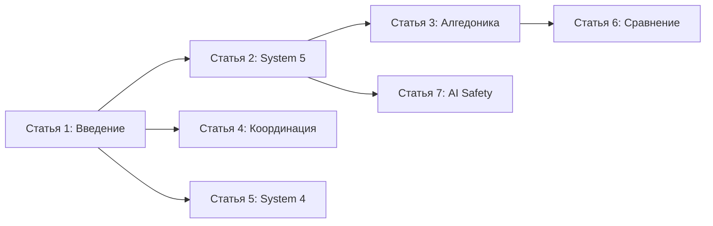

# План контента: Серия статей о Viable Core

## Оригинальные статьи-источники

Данный проект вдохновлён работами следующих авторов:

### Статьи о VSM для AI агентов:

1. **Tim Kellogg - Viable Systems: How To Build a Fully Autonomous Agent**
   - Ссылка: https://timkellogg.me/blog/2026/01/09/viable-systems
   - Описание: Статья о построении автономного агента Strix с использованием VSM, алгедонические сигналы, attractor basins, POSIWID

2. **Philipp Enderle - Your AI Agents Need an Org Chart - But Not the Kind You Think**
   - Ссылка: https://dev.to/philippenderle/your-ai-agents-need-an-org-chart-but-not-the-kind-you-think-2fg7
   - Описание: Описание проекта ViableOS, применение VSM для координации AI агентов

3. **Eoin Hurrell - Building a Multi-Agent Code Review System Using the Viable System Model**
   - Ссылка: https://github.com/eoinhurrell/AgentSymposium
   - Описание: Практическое применение VSM для мультиагентной системы код-ревью

### Дополнительные ресурсы:

4. **SublayerApp/VSM - Ruby Gem**
   - Ссылка: https://github.com/sublayerapp/vsm
   - Описание: Ruby-библиотека с реализацией VSM архитектуры

5. **SublayerApp/Airb - CLI Programming Agent**
   - Ссылка: https://github.com/sublayerapp/airb
   - Description: Open-source CLI агент на Ruby с VSM архитектурой

---

## Обзор проекта

**Viable Core** — фреймворк с открытым исходным кодом для создания устойчивых, самокорректирующихся ИИ-агентов на основе Модели Жизнеспособной Системы (VSM) Стаффорда Бира.

### Ключевые темы проекта

На основе анализа README.md и связанных статей выделены следующие ключевые направления:

| Направление | Описание |
|-------------|----------|
| VSM-архитектура | Применение кибернетики Стаффорда Бира к ИИ-агентам |
| System 5: Идентичность | Memory Blocks, ценности, аттракторные бассейны |
| Алгедонические сигналы | Синтетический дофамин, механизмы боли/удовольствия |
| System 2-3: Координация | Git-native подход, управление ресурсами, очереди |
| System 4: Осведомлённость | Сканирование окружения, адаптивность |
| System 3*: Аудит | Верификация, защита от галлюцинаций |
| AI Safety | Выравнивание, теории аттракторов |

---

## Предложенные статьи

### Статья 1: Введение в Viable Core — Архитектура для автономных ИИ-агентов

**Название:** Viable Core: От скриптов к жизни — Введение в архитектуру жизнеспособных ИИ-систем

**Abstract:**
Статья представляет Viable Core — фреймворк для создания по-настоящему автономных ИИ-агентов. Объясняется, почему стандартные подходы (промпт-инжиниринг, RAG, guardrails) недостаточны для долгосрочной автономии, и как Модель Жизнеспособной Системы (VSM) Стаффорда Бира предоставляет структурное решение. Вводится концепция метасистемы (S2-S5), которая превращает LLM из генератора текста в дееспособную систему.

**Ключевые понятия:**
- VSM (Viable System Model) — пять систем по Стаффорду Биру
- Метасистема vs. операционное ядро
- жизнеспособность (viability) в контексте ИИ
- отличие от существующих фреймворков (LangChain, AutoGPT)
- концепция синтетических существ

**Целевая аудитория:**
- Разработчики ИИ-агентов, знакомые с базовыми концепциями LLM
- Технические лидеры, оценивающие архитектуры для автономных систем
- Исследователи в области AI Safety

---

### Статья 2: Ядро идентичности — System 5 в архитектуре Viable Core

**Название:** У вашего ИИ нет Я: Как System 5 превращает модель в личность

**Abstract:**
Глубокое погружение в System 5 — наиболее критичный компонент жизнеспособной системы. Статья объясняет концепцию Memory Blocks (блоков памяти), которые хранят не историю чата, а идентичность агента: ценности, поведенческие паттерны и миссию. Раскрывается механизм самомодификации агента в пределах аттракторного бассейна и принцип POSIWID (Purpose Of System Is What It Does).

**Ключевые понятия:**
- Memory Blocks: persona, values, behavior
- аттракторные бассейны (attractor basins)
- POSIXID-принцип
- отличие от обычной памяти/контекста
- процесс инициализации идентичности
- мета-контроль vs. контроль

**Целевая аудитория:**
- Разработчики, создающие долгоживущих агентов
- Исследователи проблем выравнивания (alignment)
- Специалисты по персонификации ИИ

---

### Статья 3: Синтетический дофамин — Алгедонические сигналы в ИИ-системах

**Название:** Боль и удовольствие для ИИ: Как алгедонические сигналы делают агентов жизнеспособными

**Abstract:**
Статья представляет революционную концепцию алгедонических сигналов — механизмов боли и удовольствия для ИИ. Вместо жёстких правил (guardrails), система использует сигналы обратной связи: позитивные сигналы фиксируют победы (wins), формируя синтетический дофамин, а негативные запускают механизм диссонанса, заставляя агента рефлексировать. Объясняется, как это связано с быстрым путём от S1 к S5.

**Ключевые понятия:**
- алгедонические сигналы в кибернетике
- синтетический дофамин: журнал побед (wins.jsonl)
- детектор диссонанса
- подкрепление полезного поведения
- прерывание нежелательного поведения
- биологические аналогии

**Целевая аудитория:**
- Разработчики агентных систем
- Исследователи reinforcement learning
- Специалисты по AI Safety

---

### Статья 4: Архитектура координации — Git-native подход к управлению агентами

**Название:** Git как мозг: Координация и контроль в мультиагентных системах

**Abstract:**
Практическое руководство по реализации System 2 и System 3 в Viable Core. Статья объясняет Git-native подход, при котором все состояния, память и логи хранятся в Git, позволяя агенту путешествовать во времени, откатывать ошибки и синхронизировать параллельные ветки мышления. Раскрываются механизмы управления ресурсами: очереди, приоритеты, планирование задач.

**Ключевые понятия:**
- Git для хранения состояния и памяти
- мьютексы и контроль параллелизма
- очереди задач (queue)
- файлы today.md и projects/
- управление токенами и бюджетом
- распределённые агенты на нескольких машинах

**Целевая аудитория:**
- Разработчики мультиагентных систем
- DevOps-инженеры, работающие с ИИ
- Архитекторы распределённых систем

---

### Статья 5: Осведомлённость об окружении — System 4 и адаптивность агентов

**Название:** Агент, который смотрит наружу: System 4 для адаптивных ИИ-систем

**Abstract:**
Статья посвящена System 4 — функции интеллекта в понимании кибернетики (военная разведка, а не IQ). Объясняется, как агенты на базе Viable Core не ждут ввода пользователя, а активно сканируют среду: новости, изменения в базах данных, системные логи. Раскрывается концепция адаптивности и реакции на условия, которые агент никогда не видел.

**Ключевые понятия:**
- сканирование окружения
- триггеры и запланированные задачи
- интеграция внешних данных
- адаптивность vs. реактивность
- режимы отказа в новых условиях
- cron-задачи для автономной работы

**Целевая аудитория:**
- Разработчики автономных систем
- Специалисты по интеграциям
- Продуктовые владельцы ИИ-решений

---

### Статья 6: Viable Core vs. Существующие решения — Сравнительный анализ

**Название:** Почему ваш агент застревает в циклах: Сравнение Viable Core с существующими фреймворками

**Abstract:**
Критический анализ текущего состояния разработки ИИ-агентов. Статья объясняет, почему без метасистемы (S2-S5) агенты нежизнеспособны — они либо впадают в циклы, либо теряют контекст. Проводится сравнение с популярными решениями: LangChain, AutoGPT, CrewAI, Semantic Kernel. Показывается, что большинство фреймворков фокусируются только на System 1.

**Ключевые понятия:**
- сравнение с LangChain, AutoGPT, CrewAI
- патологии нежизнеспособных систем
- бесконечные циклы и потеря контекста
- галлюцинации и отсутствие верификации (S3*)
- domainance vs. координация
- миграция от существующих решений

**Целевая аудитория:**
- Разработчики, выбирающие фреймворк
- Технические архитекторы
- CTO и технические лидеры

---

### Статья 7: AI Safety и Viable Core — Выравнивание через архитектуру

**Название:** AI Safety начинается с архитектуры: Как Viable Core решает проблему выравнивания

**Abstract:**
Статья рассматривает Viable Core через призму AI Safety. Объясняется, как архитектурные решения VSM встроенно решают проблемы выравнивания: система ценностей в S5, аттракторные бассейны, ограничение самомодификации. Обсуждаются связи между разработкой агентов и личными отношениями — неожиданный инсайт из кибернетики.

**Ключевые понятия:**
- alignment problem и его решение через VSM
- аттракторные бассейны как механизм безопасности
- мета-контроль вместо контроля
- связь с человеческой психологией
- выгорание и психоз ИИ
- этические аспекты создания автономных систем

**Целевая аудитория:**
- Исследователи AI Safety
- Этики ИИ
- Разработчики ответственного ИИ

---

## Дополнительные темы для расширения

### Практические примеры (use cases)

| Сценарий | Описание |
|----------|----------|
| Coding Agent | Автономный разработчик для долгосрочных проектов |
| Chief of Staff | ИИ-помощник для управления бизнес-процессами |
| Ops Agent | Автоматическое управление инфраструктурой |
| Исследовательский агент | Автономное проведение экспериментов |

### Технические deep-dives

| Тема | Описание |
|------|----------|
| Формат JSONL для логов | events.jsonl, wins.jsonl и их использование |
| YAML-блоки памяти | Структура и схема блоков памяти |
| Интеграция с Claude API | Управление токенами и сессиями |

---

## Рекомендации по публикации

### Формат статей

1. **Длина:** 3000-5000 слов для глубоких технических статей
2. **Структура:** Введение → Проблема → Решение VSM → Практика → Выводы
3. **Визуализации:** Mermaid-диаграммы архитектуры, схемы потоков данных
4. **Примеры кода:** YAML-конфигурации, примеры блоков памяти

### Каналы распространения

- **Хабрахабт:** Русскоязычная техническая аудитория
- **Dev.to:** Международное developer-сообщество
- **Medium:** AI Safety и исследовательская аудитория
- **GitHub:** Документация в репозитории проекта

### Последовательность публикации

---

## Заключение

Данный план покрывает все ключевые аспекты Viable Core и предоставляет структурированный подход к созданию контента. Статьи можно публиковать независимо, но они формируют единую нарративную линию: от введения в концепцию до глубоких аспектов AI Safety.

**Следующие шаги:**
1. Утвердить приоритетность статей
2. Начать с первой статьи (Введение)
3. Параллельно готовить примеры кода и диаграммы
